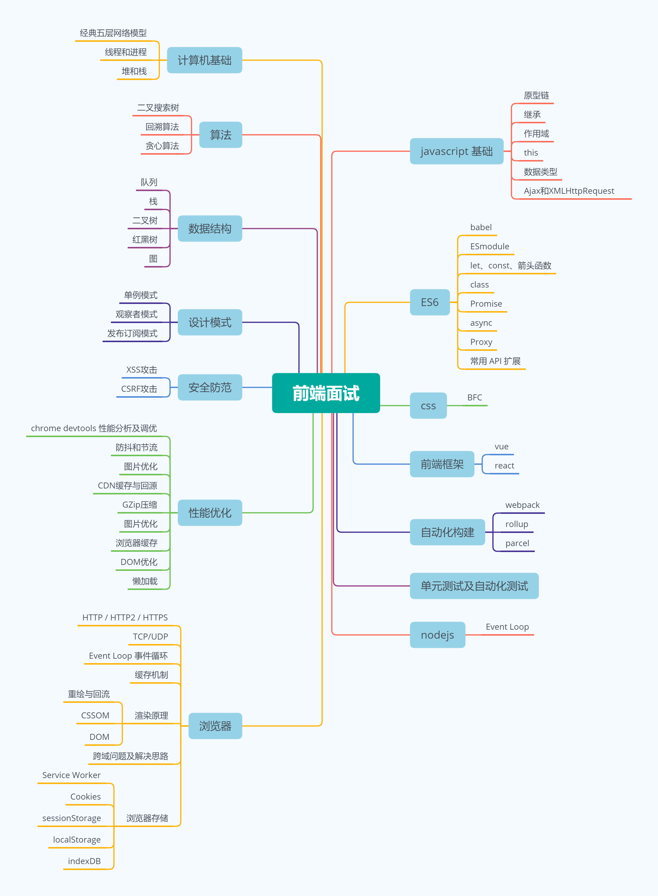

# 序章

> [《前端面试指南》Github 版](https://github.com/CRONWMMM/gitbook-FrontendInterviewGuide)  已同步更新，欢迎各位大佬 `star` `fork` 和 `issue` 😃😃

写这本 `gitbook` 的初衷其实很简单，就是为了面试。

在过去的两年多的工作时间里，我经历了两次面试准备。每次复习时， 那种面对着茫茫知识海洋却无处下手的迷茫感真的令人绝望，每个知识点好像都能聊个大概，但是零零碎碎地散落脑海里，无法串联起来，更不要说理解知识点里面的深刻机制。好不容易在网上东拼西凑找到相关内容复习完成，也只是够应付个普通面试，等入职后写点业务代码马上忘光，等下次还要从头再来一遍……

既然我不是个聪明的人，那还是找个地方把它们记录下来吧。

在编写指南的过程中，我逐渐意识到，这本指南并不仅仅只针对面试，更重要的是它在帮助我构建前端知识的体系。将零碎的知识点串联并且深入挖掘，不时翻阅，可以帮助我发现问题及复习总结。虽然写作的过程十分漫长，但是它确实是在帮助我进步，我也希望，它能够帮到你。

这篇指南，涵盖了**“js基础”、“ES6”、“浏览器”、“CSS”、“框架”、“性能优化”、“自动化构建”**在内的大部分面试常见考点。这是个非常庞大的工程，很多领域我自己也没有很深的涉入，但是我会一直编写和完善。


每篇文章下方我会注明相关参考的链接，如果有遗漏请 `issue` 联系我，确实有所参考我会第一时间加上。同时，如果有什么想要了解的内容也可以在 `issue` 上给我留言😃


希望这本指南能帮助大家找到理想的工作，梳理出自己的一套前端体系，我们开始吧。

