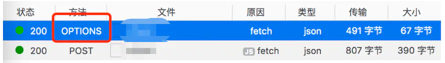

# HTTP/TCP/IP

### 访问网页时发生了什么

当用户在浏览器地址栏输入地址，敲下回车键，直到看到网页界面，一般时间不过两三秒左右。然而在这瞬时间，计算机实际上已经完成了非常复杂的操作。这段过程中发生的事情，其实有很大一部分就与 `HTTP` `TCP/IP` 有关，我们可以简要的概括一下大概的流程。

#### 第一步，找服务器 IP

当用户输入一个网址并按下回车键的时候，浏览器得到了一个域名。而在实际通信过程中，浏览器需要的是一个 `IP` 地址。为了获得 `IP` 地址，浏览器会做如下操作，一般我们把浏览器通过域名查找对应 `IP` 的行为叫做 `DNS` 解析。 1. 先找浏览器的本地的缓存 2. 再找电脑硬盘里的 `host` 文件，有没有记录这个域名和 `IP` 的映射关系 3. 实在没找到，只好通过网络链路去域名供应商那里查询

#### 第二步，建立 TCP/IP 连接

1. 浏览器获取到了服务器对应 `IP`，就会向对应 `IP` 的服务器发送 `TCP` 连接请求。
2. 服务器收到请求后回应，双方多次确认后建立起 `TCP 双向连接`。

   > 从客户端发起连接请求一直到 `TCP` 连接建立，这个过程，叫做 `三次握手`。


如果请求是 HTTPS 的，还需要在 `TCP` 连接上，再通过 `SSL` 或 `TLS` 提供加密处理数据、验证对方身份以及数据完整性，来保证数据传输的安全。


#### 第三步，请求资源

1. `TCP` 连接创建完成，浏览器开始向服务端发送正式的 `HTTP` 请求的数据包。
2. 服务端接受请求，对请求进行解析，经过数据操作后，返回客户端需要的数据包。

#### 第四步，浏览器渲染

浏览器获取到需要的数据以后，对数据进行拼接、解析、执行，最终将完整的网页绘制在页面上。

#### 第五步，浏览器缓存

浏览器拿到服务端返回的数据后，会根据一定的策略进行数据的缓存，这样在下一次请求同样数据的时候，就可直接到缓存拿取，不再请求服务器。

上述流程可以看作是一个应用在完整网络通信过程中的实践场景，其中带出了很多网络通信的知识点，下面就以这条线为索引，对其中涉及到的知识碎片进行阐述和说明。

### 经典网络五层模型


在每台计算机设备上，都有这么一套系统链路的关系，来保证网络传输的正常进行，因为统一集成了这么一套经典模型，所以自己使用的计算机也是可以作为一台服务器来提供网络服务的。

#### 应用层：

应用层包含了我们所说的 `HTTP` 协议，为各个应用软件提供了很多服务，常见的应用层服务有：`HTTP` 服务 、`FTP` 服务 、`Email` 服务等。应用层屏蔽了底层模型的相关细节，作为应用支持，只提供给使用者一些必要的使用方式。

#### 传输层

常见的传输层协议有 `TCP` 和 `UDP` ，传输层作为为应用层的基础，定义了“端到端（end to end）”之间数据间的传输方式，比如：两台设备如何建立连接？设备之间需要以何种规范进行数据传输？需要以什么方式进行数据的分片、重组、拼接？这些都是传输层为我们定义好的。

#### 网络层

通常我们常说的 `IP` 协议就位于这一层。网络层为数据在结点之间传输创建逻辑链路，当我们在浏览器敲下域名，浏览器在网络里如何通过这个域名，找到对应的 `IP` 映射，这个查询的逻辑关系和链路，是网络层规范和定义的。

#### 数据链路层

数据链路层在通信实体间建立数据链路连接，物理设备连接完成以后，需要相应的软件和驱动来连接和打通这些物理设备，创建电路的连接。

#### 物理层

定义物理设备如何传输数据，常见的物理层有网线，光缆，网卡，声卡等，物理层是一切软件的基础。

### URI、URL 和 URN

对于 `URL` 我们基本比较熟悉，然而对 `URI` 和 `URN` 的了解可能比较少，`URI`、`URL` 和 `URN` 是识别、定位和命名互联网上的资源的标准途径。

当我们在浏览器地址栏里输入域名的那一刻，其实已经和这三个概念牵扯上了联系。


#### URI

* Uniform Resource Identifier，统一资源标识符，简称为 `URI`。
* 每个 Web 服务器都有一个 `URI` 标识符，它在世界范围内唯一标识并定位信息资源，一个资源信息有了 `URI` 标识以后，在互联网上就能通过一个固定的地址访问到这个资源。
* 它具有两种形式，URN （统一资源名）、URL（统一资源定位符），也就是说 `URL` 和 `URN` 是它的子集。

#### URL

Uniform Resource Locator，统一资源定位符，简称 `URL`，下图是一个完整的 `URL` 组成。


一个完整的 `URL` 从左到右包含如下部分： 1. **schema** 标识了这个资源地址所基于的访问协议，常见的比如：`HTTP` 和 `FTP`。 2. **user information** 标识了用户信息（如果这个资源需要用户信息认证的话），不过一般现在的认证都不采用这种方式，一来输入非常麻烦，二来不安全。 3. **host** 标识了资源的域信息，可以是域名，也可以是 `IP` ，这块的作用主要是找到资源所存放的物理服务器地址。 4. **port** 端口号，一个物理服务器，通过开启不同的端口，就同时可以运行多个 web 服务器，资源文件会部署在某一个 web 服务器的某一个地方，而端口号就是用来定位资源存在的 web 服务器的。 5. **path** 路径，或者叫路由，一个 web 服务器下有许多目录，一般 path 就是用来定位到资源文件所存放的目录的。由于现在很多的 web 应用非常庞大，这个路径也不一定就是目录地址，也可能是 web 服务器指定的静态资源文件的请求地址。 6. **query** 查询字符串，一般用于 `GET` 查询，传递查询参数。 7. **fragment** 片段，哈希，或者叫锚点，主要用于前端文档的定位，或者是前端渲染时控制路由跳转的手段。


这里需要注意将 `URL` 与网址区别开来。 `URL` 不仅仅包含了网页的资源地址，还包含了组成网页所需的图片、视频等超文本资源，以及 css js 等资源地址。 网址本质上是 `IP` 地址的一个更有辨别度的映射，在通过 `DNS` 解析之后，浏览器最先拿到的是 html 文档的 `URL` 地址，根据浏览器对 Html 文档的解析，继续通过网页内其他资源文件的 `URL` 获取对应的资源文件。


#### URN

Uniform Resource Name，统一资源名称，简称 `URN`，它的用处简单说就是永久定位资源，因为同一个资源可能会更换存储位置，存储位置一旦更换，再访问原来的 url 肯定是拿不到的，URN 就是解决这个问题的，不管资源位置怎么移动，只要访问同一个 `URN` 都能定位到。

### TCP/IP 协议族

`TCP` 连接的建立，是网络通信成功不可或缺的一步，因此，`TCP/IP` 也成为了一个十分重要的知识点。


`TCP/IP` 协议（传输控制协议/互联网协议）不是简单的一个协议，而是一组特别的协议，包括：TCP，IP，UDP，ARP等，这些被称为子协议。在这些协议中，最重要、最著名的就是 `TCP` 和 `IP`。因此我们习惯将整个协议族称为 `TCP/IP`。


* **IP 协议**
  * `IP` 协议使互联网成为一个允许连接不同类型的计算机和不同操作系统的网络。
  * `IP` 地址是 `IP` 协议提供的一种统一的地址格式，它为互联网上的每一个网络和每一台主机分配一个逻辑地址，相当于这台机器的暂用名，别的机器可以通过这个名字找到它，进而能互相建立起连接进行通信和交流。
* **TCP 协议**
  * `TCP` 协议是面向连接的全双工协议，因此不管是客户端还是服务端都能在 `TCP` 连接通道下向对端接收和发送数据。
  * `TCP` 相比于 `UDP` 的优势在于它的传输稳定性，在数据传输之前必须经过三次握手建立连接；在数据传输过程中必须保证数据有序完整地传到对端。
  * `TCP` 相比于 `UDP` 的劣势在于它的复杂度，连接建立、断开都是比较大的性能开销，而且数据传输过程中一旦卡住，则必须等前面的数据发送完毕以后，后续数据才能继续传输。
  * 每台服务器可提供支持的 `TCP` 连接数量是有限的，所以这也使得 `TCP` 连接变成了稀缺资源，经不起浪费。
* **UDP 协议**
  * `UDP` 协议是面向无连接的，不需要在传输数据前先建立连接，想发就发想传就传。
  * `UDP` 做的工作只是报文搬运，不负责有序且不丢失地传递到对端，因此容易出现丢包的情况。
  * `UDP` 不仅支持一对一的传输方式，还支持一对多、多对多、多对一的方式，也就是说 `UPD` 提供了单播、多播、广播的功能。
  * `UDP` 相比于 `TCP` 的优势在于它的轻量、高效和灵活，在一些对于实时性应用要求较高的场景下需要使用到 `UDP`，比如直播、视频会议、LOL等实时对战游戏。
  * `UDP` 相比于 `TCP` 的劣势在于它的不可靠性和不稳定性。

### TCP 连接

在客户端发送正式的 `HTTP` 请求之前，需要先创建一个 `TCP` 连接，在创建的 `TCP Connect` 通道下，所有的 `HTTP` 请求和响应才能正常的发送和接受。

在不同的 `HTTP` 协议版本里，这个 `TCP` 连接通道的创建和持续机制也有所不同。

* 在 `HTTP1.0` 中，每一次 `HTTP` 请求都会创建一个 `TCP` 连接，在请求发送完成，服务器响应以后，这个 `TCP` 连接就自动断开了。
* 在 `HTTP1.1` 中，可以通过手动设置 `Connection： keep-alive` 请求头来建立 `TCP` 的持久连接，多个 `HTTP` 请求可以共用一个 `TCP` 连接。但是 `TCP` 连接存在线头阻塞，即若干个请求排队等待发送，一旦有某请求超时等，后续请求只能被阻塞。
* 在 `HTTP2` 中，采用了信道复用，使 `TCP` 连接支持并发请求，即多个请求可同时在一个连接上并行执行。某个请求任务耗时严重，不会影响到其它连接的正常执行吗，这样一来，大部分请求可以使用一个 `TCP` 连接，而不用创建新的 `TCP` 连接通道，既节省了三次握手的开销，又节约了服务端维护 `TCP` 端口的成本。

### TCP 的三次握手和四次挥手

#### 三次握手



关于 `ACK`、`FIN`、`SYN` 状态码的含义 1. `ACK` 用于确认，表示通知对方，我已经收到你发来的信息了。 2. `FIN` 用于结束，表示告知对方，我这边已经结束，数据全部发送完毕，没有后续输出，请求终止连接。 3. `SYN` 用于同步和建立连接，表示告知对方，我这边请求同步建立连接。


1. 第一次握手：由客户端向服务端发送连接请求 `SYN` 报文，该报文段中包含自身的数据通讯初始序号，请求发送后，客户端便进入 `SYN-SENT` 状态。
2. 第二次握手：服务端收到连接请求报文段后，如果同意连接，**则会发送一个包含了 `ACK` 和 `SYN` 报文信息的应答，该应答中也会包含自身的数据通讯初始序号**（在断开连接的“四次挥手”时，`ACK` 和 `SYN` 这两个报文是作为两次应答，独立开来发送的，因此会有四次挥手），服务端发送完成后便进入 `SYN-RECEIVED` 状态。
3. 第三次握手：当客户端收到连接同意的应答后，还要向服务端发送一个确认报文。客户端发完这个报文段后便进入 `ESTABLISHED` 状态，服务端收到这个应答后也进入 `ESTABLISHED` 状态，此时连接建立成功。


面试时可能会问的一个问题就是，明明两次握手就能确定的连接，为什么需要三次握手？ 因为由于很多不可控制的因素，例如网络原因，可能会造成第一次请求隔了很久才到达服务端，这个时候客户端已经等待响应等了很久，之前发起的请求已超时，已经被客户端废弃掉不再继续守着监听了。 然而服务端过了很久，收到了废弃的延迟请求，发起回应的同时又开启了一个新的 `TCP` 连接端口，在那里呆等客户端。 而服务端能维护的 `TCP` 连接是有限的，这种闲置的无用链接会造成服务端的资源浪费。 因此在服务端发送了 `SYN` 和 `ACK` 响应后，需要收到客户端接的再次确认，双方连接才能正式建立起来。三次握手就是为了规避这种由于网络延迟而导致服务器额外开销的问题。


#### 四次挥手


和建立 `TCP` 连接类似，断开 `TCP` 连接也同样需要客户端于服务端的双向交流，因为整个断开动作需要双端共发送 4 个数据包才能完成，所以简称为“四次挥手”。 1. 第一次挥手：客户端认为自己这边的数据已经全部发送完毕了，于是发送一个 `FIN` 用来关闭客户端到服务端的数据传输，发送完成以后，客户端进入 `FIN_WAIT_1` 状态。 2. 第二次挥手：服务端收到客户端发送回来的 `FIN` 以后，会告诉应用层要释放 TCP 链接，并且发送一个 `ACK` 给客户端，表明已经收到客户端的释放请求了，不会再接受客户端发来的数据，自此，服务端进入 `CLOSE_WAIT` 的状态。 3. 第三次挥手：服务端如果此时还有未发送完的数据可以继续发送，发送完毕后，服务端也会发送一个释放连接的 `FIN` 请求用来关闭服务端到客户端的数据传送，然后服务端进入 `LAST_ACK` 状态。 4. 第四次挥手：客户端接收到服务端的 `FIN` 请求后，发送最后一个 `ACK` 给服务端，接着进入 `TIME_WAIT_2` 状态，该状态会持续 2MSL（最大段生存期，指报文段在网络中生存的时间，超时会被抛弃） 时间，若该时间段内没有服务端的重发请求的话，客户端就进入 `CLOSED` 状态.服务端在收到应答消息后，也会进入 `CLOSED` 状态，至此完成四次挥手的过程，双方正式断开连接。

上面的内容可能还是有些不够直观，所以我还准备了一段人话来描述整个过程： 1. 客户端：喂，我好了。 2. 服务端：噢，你好了是吧，我知道了，我还没好，你等一哈。 3. 服务端：OK，现在我也好了。 4. 客户端：收到，这次玩的很开心，我们下次再约。


可能有些面试中会问，为什么建立连接有三次握手，而断开连接却有四次？ 这是因为在建立连接过程中，服务端在收到客户但建立连接请求的 `SYN` 报文后，会把 `ACK` 和 `SYN` 放在一个报文里发送给客户端。 而关闭连接时，服务端收到客户端的 `FIN` 报文，只是表示客户端不再发送数据了，但是还能接收数据，而且这会儿服务端可能还有数据没有发送完，不能马上发送 `FIN` 报文，只能先发送 `ACK` 报文，先响应客户端，在确认自己这边所有数据发送完毕以后，才会发送 `FIN`。 所以，在断开连接时，服务器的 `ACK` 和 `FIN` 一般都会单独发送，这就导致了断开连接比请求连接多了一次发送操作。


### HTTP 定义

一旦端对端成功建立起了 `TCP` 连接，下一步就要开始发送正式的 `HTTP` 请求了。流淌在 `TCP Connect` 通道里的 `HTTP` 只负责传输数据包，并没有连接的概念，因此 `HTTP` 也被叫做“无状态协议”。


`HTTP` 协议是 Hyper Text Transfer Protocol（超文本传输协议）的缩写，它通常运行在 `TCP` 之上，通过浏览器和服务器进行数据交互，进行超文本（文本、图片、视频等）传输的规定。也就是说，`HTTP` 协议规定了超文本传输所要遵守的规则。


1. **`HTTP` 协议是无状态的**。这意味着客户端和服务端之间无法知晓当前对方的状态信息，`HTTP` 请求本身是不带有任何状态存储的。但实际情况下，客户端和服务端必然需要状态的认证和交互，所以就引入了 `Cookie`， 用于存储当前浏览器的一些状态信息，每次通过独立的 `HTTP` 请求进行收发，从而解决这个问题。
2. **`HTTP` 请求互相独立**。`HTTP` 互相之间都是一个独立的个体请求，在客户端请求网页时多数情况下并不是一次请求就能成功的，服务端首先是响应 `HTML` 页面，然后浏览器收到响应之后发现页面还引用了其他的资源，例如，CSS，JS文件，图片等等，还会自动发送 `HTTP` 请求获取这些需要的资源。
3. **`HTTP` 协议基于 `TCP` 协议**。`HTTP` 协议目的是规定客户端和服务端数据传输的格式和数据交互行为，并不负责数据传输的细节，底层是基于 `TCP` 实现的。现在使用的版本当中是默认持久连接的，也就是多次 `HTTP` 请求使用一个 `TCP` 连接。


`HTTP` 请求和 `TCP` 连接是不一样的，`HTTP` 是在 `TCP` 连接建立的基础上而发起的传输请求，在同一个 `TCP` 连接通道下，可以发送多个 `HTTP` 请求，举个例子的话就是高速公路和车子的关系。


### HTTP 发展历史

#### HTTP 0.9 版本

* 只有一个 `GET` 命令。
* 没有请求头和响应头来描述传输相关的数据信息。
* 服务器发送完数据后，直接关闭 `TCP` 连接，不支持 `TCP` 持久化连接。

#### HTTP 1.0 版本

* 增加了很多命令，`HEAD`、`POST`、`PUT`、`DELETE` 等。
* 增设了 `status code` 状态码和 `header` 请求头和响应头。
* 增加了多字符集支持、多部分发送、权限、缓存等。
* 可通过开启 `Connection： keep-alive` 来指定使用 `TCP` 长连接

#### HTTP 1.1 （目前普遍使用）

* 默认支持持久连接
* 默认支持长连接（PersistentConnection），即默认开启 `Connection： keep-alive`。
* 支持请求的流水线（Pipelining）处理，即在一个 `TCP` 连接上可以传送多个 `HTTP` 请求和响应。
* 增加了 `host` 请求头字段，通过对 `host` 解析，就能够允许在同一台物理服务器上运行多个软件服务，极大提高了服务器的使用率。目前的 `nginx` 反向代理就是根据 `HTTP` 请求头中的 `host` 来分辨不同的请求，从而将这些请求代理到同一台服务器不同的软件服务上。

#### HTTP 2.0

* `HTTP1.x` 的解析是基于文本，存在解析上的缺陷；而 `HTTP2.0` 直接使用二进制的解析方式来替代 `HTTP 1.X` 的字符串解析，更为高效和健壮。
* `HTTP2.0` 所有数据以“帧”的方式进行传输，因此同一个连接中发送的多个请求不再需要按照顺序进行返回处理，可以达到并行的数据传输。
* `HTTP2.0` 压缩头信息进行传输数据量的优化。`HTTP1.x` 的请求头带有大量信息，而且每次都要重复发送，`HTTP2.0` 使用 `encoder` 来减少需要传输的请求头大小，通讯双方各自缓存一份 `header fields` 表，既避免了重复的传输，又减小了传输信息的大小。
* `HTTP2.0` 新增了 `server push`（服务端推送） 的概念，服务端可以主动发起一些数据推送。比如，服务端在接收到浏览器发来的 `HTML` 请求的同时，可以主动推送相关的资源文件（js/css）给客户端，并行发送，提高网页的传输和渲染效率。
* 目前如果要使用 `HTTP2` 需要首先使用 `HTTPS` 在这基础上，才能使用 `HTTP2` 


`HTTP 2.0` 相比于 `HTTP 1` 最直观的图片加载性能提升，可以看 [`HTTP 2` 性能提升的官方演示](https://link.zhihu.com/?target=https://http2.akamai.com/demo)


#### HTTPS

我们经常会在有些网页上看到悬浮的弹窗或者广告，有的时候甚至会在自己编写的上线网页上也看到这些垃圾广告，然而开发者明明没有写过这些东西，可是这种垃圾信息是怎么上去的呢？ 究其根本原因就在于各种代理服务，当我们从客户端发起一个 `HTTP` 请求，并不是直接就能传递到目标服务器的，期间会经过层层的代理服务，我们常用的 `nginx` ，以及在 `DNS` 解析过程中要经过的宽带运营商，都是一种代理服务。 由于 `HTTP` 时使用明文字符串来传递数据的，那么这些数据就能很轻易地被中间服务读取甚至篡改，那么中间服务拿到了原始的 `HTML` 数据，想插入点小广告进去自然不是难事。

`HTTPS` 是为了解决 `HTTP` 明文传输而出现的安全问题而出现的一种解决机制 ———— 对 `HTTP` 请求中的信息进行加密之后传输，从而有效地防止了中间代理服务截获或篡改信息的问题。

`HTTPS` 其实就是一个安全加强版的 `HTTP 1.1` ，有几点需要注意的是： 1. `HTTPS` 协议需要到 `CA` 申请证书，一般免费证书很少，需要交费 2. `HTTP` 协议运行在 `TCP` 之上，所有传输的内容都是明文，`HTTPS` 运行在 `SSL/TLS` 之上，`SSL/TLS` 运行在 `TCP` 之上，所有传输的内容都经过加密的。 3. `HTTP` 和 `HTTPS` 使用的是完全不同的连接方式，用的端口也不一样，前者是 **80**，后者是 **443**。 4. `HTTPS` 可以有效的防止运营商劫持，解决了防劫持的一个大问题。

### HTTP 的报文组成

`HTTP` 是以请求和响应的形式存在的，由于发起方主动发起一个 `HTTP` 请求，然后由响应方回应，双方按照一定的报文格式进行数据的互传，一个完整的 `HTTP` 报文通常由 **首行**、**首部** 和 **主体** 构成。


#### 首行

首行并不属于 `Http Headers` ，它包含了： 1. **HTTP Method**（`GET`、`POST`、`PUT`、`DELETE` 等 ），不同的 `HTTP Method` 有不同的语意。

| HTTP Method | 对应予以 |
| :--- | :--- |
| GET | 一般用于获取服务器资源 |
| POST | 一般用于传输实体主体 |
| PUT | 一般用于传输文件 |
| DELETE | 用于删除文件 |
| HEAD | 用于获取报文首部，不返回报文主体 |
| OPTIONS | 用于预检请求中，询问请求URI资源支持的方法 |


`HTTP Method` 只是 `HTTP` 协议推崇的一种规范，就像 `ESLint`，你可以选择遵循，也可以选择不遵循，它们所作的事情实质上没有差别，只是语义化更明确。


1. **URL**请求资源的地址，这个地址只会包含请求的路由地址。
2. **协议的版本**，`HTTP 1.0 / HTTP 1.1 / HTTP 2`。
3. **HTTP 返回状态码**（响应报文首行包含）

   > `HTTP` 定义了40个标准状态代码，可用于传递客户端请求的结果，状态代码分为以下五类，关于各个分段下的返回状态码信息可以参考 [HTTP 响应码](https://developer.mozilla.org/zh-CN/docs/Web/HTTP/Status)：



这边需要注意的一点是，一个好的 HTTP 应用服务应该是有完善的 HTTP status code 的返回信息的，即访问者单从 HTTP status &gt; code 上就能得知当前 HTTP 请求的状态信息。 而目前我们大部分的开发模式下的 HTTP 返回码，只有 `200` 和 `500`。服务端的同学会先把 `200` 返回过来，然后再告诉你出了什么 “没登录” / “没认证” / “没权限” 这一类的问题。 业界也有一句戏言：**又不是不能用**，其实这种开发方式是不正确的，不管从代码的维护性还是个人自身发展角度，我们都需要&gt; 尽量避免这种问题。


#### HTTP 头信息

HTTP 头信息，即 `HTTP Header`，首行换行后的信息都是 `HTTP Header`。`HTTP header` 里一般存放了客户端和服务端之间交互的非业务信息，例如：本次请求的数据类型、请求日期、字符集支持、自定义头部字段、一些通信凭证和缓存支持等。 `HTTP Header` 完整字段列表：[传送门](https://developer.mozilla.org/zh-CN/docs/Web/HTTP/Headers)

#### 主体

主体，即 `HTTP body`，`HTTP Header` 信息和主体信息间以一个空行 + 一个换行来区分。`HTTP body` 里一般会放置请求的一些具体业务信息

### HTTP 数据协商

在 HTTP 协议中，数据协商是这样一种机制，客户端通过请求头告知服务端本次请求希望获取的数据格式、展现形式、以及数据的压缩方式等。常见的数据协商例如，文档使用的自然语言，图片的格式，或者内容编码形式。 服务端可以对请求头中携带的数据协商字段进行解析，然后在返回客户端数据的时候，也会用**相对字段**来通知客户端：本次返回的数据格式、压缩方式等信息。这样浏览器就可以使用特定的解析方式，来对这些资源进行解析、处理和渲染。

下面简单列举一些常用的数据协商字段，[完整的数据协商信息传送门](https://developer.mozilla.org/zh-CN/docs/Web/HTTP/Content_negotiation)

* `Accept` 请求头字段，指定期望获得的数据类型
* `Accept-Encoding` 请求头字段，指定期望获得的数据需要以什么样的编码方式进行传输，常用于限制服务端对数据的压缩方式，常见的 JS 文件包大小优化的 GZIP 压缩，就使用了这个方法
* `Accept-Language` 请求头字段，指定期望获得的数据语言类型：中文、英语、还是其他语言，这个头信息字段，一般是浏览器自动加上的
* `User-Agent` 请求头字段，指定本次请求的浏览器信息，服务端可根据此信息选择不同兼容性的页面返回给用户，或者是做用户使用浏览器信息、操作系统等数据的统计
* `Content-Type` 响应头字段，请求头里的 `Accept` 字段可能会指定好几种可以接受的数据格式，服务端最终会返回一种数据格式给客户端
* `Content-Encoding` 响应头字段，对应 `Accept-Encoding` 
* `Content-Language` 响应头字段，对应 `Accept-Language` 

### HTTP 长连接

每一个 `HTTP` 请求都需要在 `TCP` 连接通道里才能完成发送和接受。在 `HTTP` 协议的早期版本里，每一条 `HTTP` 请求发送之前，都会创建一条新的 `TCP` 连接通道，在这个请求完成以后，该条 `TCP` 通道就会自动关闭。 这样带来的问题就是，单条 `TCP` 连接没有办法复用，造成很大的新能浪费。好在这一问题随着 `HTTP` 协议的逐步完善已经得到解决。

在 `HTTP 1.0` 中引入的 `Connection` 头字段，允许对其设置 `Keep-Alive` 或者是 `Close` 来决定是否需要复用 TCP 连接，还是说在一次请求完成之后直接关闭。而在 `HTTP 1.1` 中默认双端都会默认开启这个字段，即默认支持 `HTTP` 的长连接。


> 需要注意的是：`Connection: Keep-Alive` 需要双端同时开启才能启动 `HTTP` 长连接，如果任何一段手动设置 `Connection` 为 `Close`，长连接都无法位置，因为 TCP 连接的建立和持久保持是一个双端交互的过程。

那么我们在本地如何看到 `TCP` 的连接 ID 呢，可以打开 `Chrome` 的调试工具来查看：


图上可以看到有不同的 `Connection ID`，这就代表着本次请求实际上是开启了一个新的 `TCP` 连接，最下面的请求的 `Connection ID` 都是相同的，代表着多个 `HTTP` 请求复用了同一个 `TCP` 连接。


Chrome 浏览器所能够支持的最大并发 TCP 连接数是 **6个**，并且在 `HTTP 2.0` 以下的 `HTTP` 版本中，请求是阻塞的。也就是说，一旦六个连接开满，前面的请求未完成，那么后续请求就会被阻塞，直到前面的请求返回，后续才能继续发送。


### HTTP 缓存

> 虽然 HTTP 缓存不是必须的，但重用缓存的资源通常是必要的。然而常见的 HTTP 缓存只能存储 GET 响应，对于其他类型的响应则无能为力。缓存的关键主要包括 `request method` 和目标 URI（一般只有 GET 请求才会被缓存）。

#### 缓存读取策略

前端环境下的文件缓存，分为几个不同的位置。当我们打开 Chrome 控制台，查看 Network 下每条请求记录的 size 选项，会发现非常丰富的来源信息。


对于前端浏览器环境来说，缓存读取位置是由先后顺序的，顺序分别是（由上到下寻找，找到即返回；找不到则继续）

* Service Worker
* Memory Cache
* Disk Cache
* 网络请求

**Service Worker**


Service Worker 的缓存与浏览器其他内建的缓存机制不同，它可以让我们自由控制缓存哪些文件、如何匹配缓存、如何读取缓存，并且缓存是持续性的。


* 浏览器优先查找。
* 持久存储。
* 可以更加灵活地控制存储的内容，可以选择缓存哪些文件、定义缓存文件的路由匹配规则等。
* 可以从 Chrome 的 F12 中，Application -&gt; Cache Storage 查看。

**Memory Cache**

* `memory cache` 是内存中的缓存存储。
* 读取速度快。
* 存储空间较小。
* 存储时间短，当浏览器的 `tab` 页被关闭，内存资源即被释放。
* 如果明确指定了 `Cache-Control` 为 `no-store`，浏览器则不会使用 `memory-cache`。

**Disk Cache**

* `Disk Cache` 是硬盘中的缓存存储。
* 读取速度慢于 `Memory Cache` ，快于网络请求。
* 存储空间较大。
* 持久存储。
* `Disk Cache` 严格依照 `HTTP` 头信息中的字段来判断资源是否可缓存、是否要认证等。
* 经常听到的“强制缓存”，“对比缓存”，以及 `Cache-Control` 等，归于此类。

**网络请求**

如果一个请求的资源文件均未命中上述缓存策略，那么就会发起网络请求。浏览器拿到资源后，会把这个新资源加入缓存。

#### Cache-Control


HTTP/1.1定义的 Cache-Control 头用来区分对缓存机制的支持情况， 请求头和响应头都支持这个属性。通过它提供的不同的值来定义缓存策略。需要注意的是，数据变化频率很快的场景并不适合开启 `Cache-Control`。


| 指令 | 作用 |
| :--- | :--- |
| public | 公共缓存：表示该响应可以被任何中间人（比如中间代理、CDN等）缓存。 |
| private | 私有缓存：表示该响应是专用于某单个用户的，中间人不能缓存此响应，该响应只能应用于浏览器私有缓存中。 |
| max-age | （单位/秒）设置缓存的过期时间，过期需要重新请求，否则就读取本地缓存，并不实际发送请求 |
| s-maxage | （单位/秒）覆盖 max-age，作用一样，只在代理服务器中生效 |
| max-stale | （单位/秒）表示即使缓存过期，也使用这个过期缓存 |
| no-store | 禁止进行缓存 |
| no-transform | 不得对资源进行转换或压缩等操作，Content-Encoding、Content-Range、Content-Type 等 HTTP 头不能由代理修改（有时候资源比较大的情况下，代理服务器可能会自行做压缩处理，这个指令就是为了防止这种情况）。 |
| no-cache | 强制确认缓存：即每次使用本地缓存之前，需要请求服务器，查看缓存是否失效，若未过期（注：实际就是返回304），则缓存才使用本地缓存副本。 |
| must-revalidate | 缓存验证确认：意味着缓存在考虑使用一个陈旧的资源时，必须先验证它的状态，已过期的缓存将不被使用 |
| proxy-revalidate | 与 must-revalidate 作用相同，但它仅适用于共享缓存（例如代理），并被私有缓存忽略。 |


#### 缓存校验


在浏览器使用缓存的过程中，为了配合 Cache-Control 中 no-cache ，我们还需要一个机制来验证缓存是否有效。比如服务器的资源更新了，客户端需要及时刷新缓存；又或者客户端的资源过了有效期，但服务器上的资源还是旧的，此时并不需要重新发送。 缓存校验就是用来解决这些问题的，在http 1.1 中，我们主要关注下 `Last-Modified` 和 `ETag` 这两个字段。


**Last-Modified**

顾名思义，就是资源的最新一次修改时间。当客户端访问服务端的资源，服务端会将这个 `Last-Modified` 值返回给客户端，客户端收到之后，下次发送请求就会将服务端返回回来的 `Last-Modified` 值装在 `If-Modified-Since` 或者 `If-Unmodified-Since` 里，发送给服务端进行缓存校验。

这样服务器就可以通过读取 `If-Modified-Since` （较常用）或 `If-UnModified-Since` 的值，和本地的 `Last-Modified` 值做对比校验。如果校验发现这两个值是一样的，就代表本次请求的资源文件没有被修改过，那么服务器就会告诉浏览器，资源有效，可以继续使用，否则就需要使用最新的资源。

来看一下下面的两张图：

当请求服务端的 `script.js` 的脚本资源时，可以看到服务端返回了 `Last-Modified`，里面记录了该资源最后一次的修改时间


当客户端下次再次发起请求，会携带上这个过期时间给服务端进行验证


来看下服务端的部分代码：

```javascript
const http = require('http');
const fs = require('fs');
http.createServer((request, response) => {
   const ifModifiedSince = request.headers['If-Modified-Since'];
   const lastModified = 'Web Aug 19 2019 19:01:15 GMT+0800 (China Standard Time)';

   if (request.url === '/') {
       const html = fs.readFileSync('test.html', 'utf-8');

       response.writeHead(200, {
           'Content-Type': 'text/html'
       });
       response.end(html);
   }
   if (request.url === '/script.js') {
       const js = fs.readFileSync('script.js', 'utf-8');
       let status = 200;
       // 如果读取到的 If-Modified-Since 和 lastModified 相同，则设置头部 304 表示可使用缓存
       if (ifModifiedSince === lastModified) {
           status = 304;
           response.end('');
       }
       response.writeHead(status, {
           'Content-Type': 'text/javascript',
           'Cache-Control': 'no-cache,max-age=2000',
           'Last-Modified': lastModified
       });
       response.end(js);
   }
});
```

**ETag**

`Etag` 的作用本质上和 `Last-Modified` 差别不大。相比于 `Last-Modified` 使用最后修改日期来比较资源是否失效的缓存校验策略，`ETag` 则是通过**数据签名**来做一个更加严格的缓存验证。

所谓**数据签名**，其实就是通过对资源内容进行一个唯一的签名标记，一旦资源内容改变，那么签名必将改变，服务端就以此签名作为暗号，来标记缓存的有效性。典型的做法是针对资源内容进行一个 hash 计算，类似于 webpack 打包线上资源所加的 hash 标识

和 `Last-Modified` 对应 `If-Modified-Since` 相同，`ETag` 也会对应 `If-Match` 或者 `If-None-Match`（`If-None-Match` 比较常用），如果前后的签名相同，则不需要返回新的资源内容。

**缓存校验的合理使用**

> `Last-Modified` 和 `ETag` 只是给服务端提供了一个控制缓存有效期的手段，并没有任何强制缓存的作用，最终决定是否使用缓存、还是使用新的资源文件，还是需要靠服务端指定对应的 `http code` 来决定。 对于保存在服务器上的文件，都有最后修改日期的属性，当使用 `Last-Modified` 可以利用这个有效的属性进行数据缓存验证；或者在数据库存入一个 `updatetime` 字段来标识具体的修改日期，从而判断缓存是否有效。 具体如何构建一个能够合理使用缓存的服务器，就比较涉及后端知识了，这里不做具体描述。

### 浏览器的同源策略

> 浏览器的同源限制：当**浏览器**访问 URL 地址的**协议（schema）/ 端口（port）/ 域名（host）**，三者中有任何一个与当前的 URL 片段信息不匹配的时候，便存在跨域问题。

| 当前地址 | 请求地址 | 请求是否成功 |
| :--- | :--- | :--- |
| [https://www.juejin.com:80](https://www.juejin.com:80) | [http://www.juejin.com:80](http://www.juejin.com:80) | 跨域（协议不同） |
| [https://www.juejin.com:80](https://www.juejin.com:80) | [https://www.juejin.cn:80](https://www.juejin.cn:80) | 跨域（域名不同） |
| [https://www.juejin.com:80](https://www.juejin.com:80) | [https://www.juejin.com:90](https://www.juejin.com:90) | 跨域（端口不同） |

对于跨域的几点需要明确： 1. **跨域，是浏览器提供的一种保护手段**，服务端是不存在跨域这一说的。这也就是为什么现在前后端分离的开发模式下，前端比较依赖 `webpack-dev-server` 启动代理服务来中转和代理后台接口的原因，因为两个服务器之间相互通信是没有跨域障碍的。 2. **跨域，是对于 XMLHttpRequest 来说的，浏览器获取不同源服务器下的静态资源，是没有跨域限制的**，这也是 `JSONP` 跨域请求得以实现的本质。 3. 不同于 XMLHttpRequest 的是，**通过 src 属性加载的脚本资源，浏览器限制了 Javascript 的权限，使其不能读写、返回内容**。 4. 对于浏览器来说，除了 DOM 、Cookie、XMLHttpRequest 会收到同源策略限制以外，一些常见的插件，比如 Flash、Java Applet 、Silverlight、Google Gears 等也都有自己的控制策略。


当浏览器向不同域的服务器发送请求时，请求是真能发出去，对方服务端也是真能接收到请求，并且真能给你的浏览器响应，浏览器也真能接收到有效数据。 但是，如果在跨域的情况下、服务端返回数据的响应头里的 `Access-Control-Allow-Origin` 字段，没有把当前域名列进白名单，那么浏览器会把服务端返回的数据给藏起来，不告诉你，然后给你抛个 `Access-Control-Allow-Origin` 的错误。



至于为什么资源文件不受同源策略限制呢？可以试想一下，如果资源文件也被限制跨域，那么现在大量使用的 CDN 缓存策略基本就没办法用了。而且现在很多网站的资源文件，都会放到云服务器的 OSS 上，OSS 资源对应的 url 地址肯定是不同域的，那这些资源也不能使用了。


#### Access-Control-Allow-Origin

`Access-Control-Allow-Origin` 标识了服务器允许的跨域白名单，它有以下几种设置方法： 1. 直接设置 `*` 通配符，简单粗暴，但是这么做等于把服务器的所有接口资源对外完全暴露，是不安全的。 2. 设置制定域，比如 `Access-Control-Allow-Origin: https://www.baidu.com` ，这样只会允许指定域的请求进行跨域访问。 3. 由后端动态设置。`Access-Control-Allow-Origin` 限制只能写一个白名单，但是当我们有多个域都需要跨域请求怎么呢？这个时候，这时可以由服务端自己维护一套白名单列表，在请求进来的时候对请求的源 `host` 进行白名单比对，如果在白名单中，就将这个 `Access-Control-Allow-Origin` 动态设置上去，然后返回响应。

#### CORS 的预请求

如果我们像上面一样，只设置的 `Access-Control-Allow-Origin` 白名单，是否就可以完全畅通无阻地进行跨域了呢？并不是。 就算对端开启了域名白名单认证，然鹅有一些操作仍然是需要进一步认证的，这种进一步的认证操作，就是 `CORS 预请求`。

#### 预请求触发过程

浏览器预请求的触发条件，**是判断本次请求是否属于一个简单请求**。 如果本次请求属于一个**复杂请求**，那么在发送正式的跨域请求之前，浏览器会先准备一个名为 `OPTIONS` 的 `HTTP Method` ，作为预请求发送。 在服务器通过预请求后，下面浏览器才会发生正式的数据请求。整个请求过程其实是发生了两次请求：一个预检请求，以及后续的实际数据请求。



#### 简单请求

1. 请求方式只能是 `GET` `POST` `HEAD`
2. 请求头字段只允许：
   * `Accept`
   * `Accept-Language`
   * `Content-Language`
   * `Content-Type`
3. `Content-Type` 的值仅限于：
   * `text/plain`
   * `multipart/form-data`
   * `application/x-www-form-urlencoded`
4. `XMLHttpRequestUpload` 对象均没有注册任何事件监听器（了解就好）。
5. 请求中没有使用 `ReadableStream` 对象（了解就好）。

#### 复杂请求

除了简单请求里定义的，都是复杂请求，统统需要预请求。

#### 预请求的验证

那么怎样使预检请求成功认证呢？还是需要服务端继续帮忙设置请求头的白名单：

1. `Access-Control-Allow-Headers`，设置允许的额外请求头字段。
2. `Access-Control-Allow-Methods`，设置允许的额外请求方法。
3. `Access-Control-Max-Age` （单位/秒），指定了预请求的结果能够被缓存多久，在这个时间范围内，再次发送跨域请求不会被预检。

> 更多、更具体的跨域限制策略可以[点击这里查看更多](https://developer.mozilla.org/zh-CN/docs/Web/HTTP/Access_control_CORS)

### HTTP 性能优化方案

1. 合理使用 `HTTP` 的缓存策略，避免同一资源多次请求服务端而导致的额外性能开销
2. 尽量使用 `HTTP` 长连接，避免每次重建 `TCP` 连接带来的时间损耗
3. 尽量使用 `HTTPS` 来保证网络传输的安全性。
4. 可以使用 `HTTP2` 来大幅提高数据传输的效率，使用 `server push` 开启 `HTTP2` 的服务端推送功能
5. 客户端开启 `Accept-Encoding` 压缩方式的支持，服务端传输压缩后的文件，减少传输数据的大小

