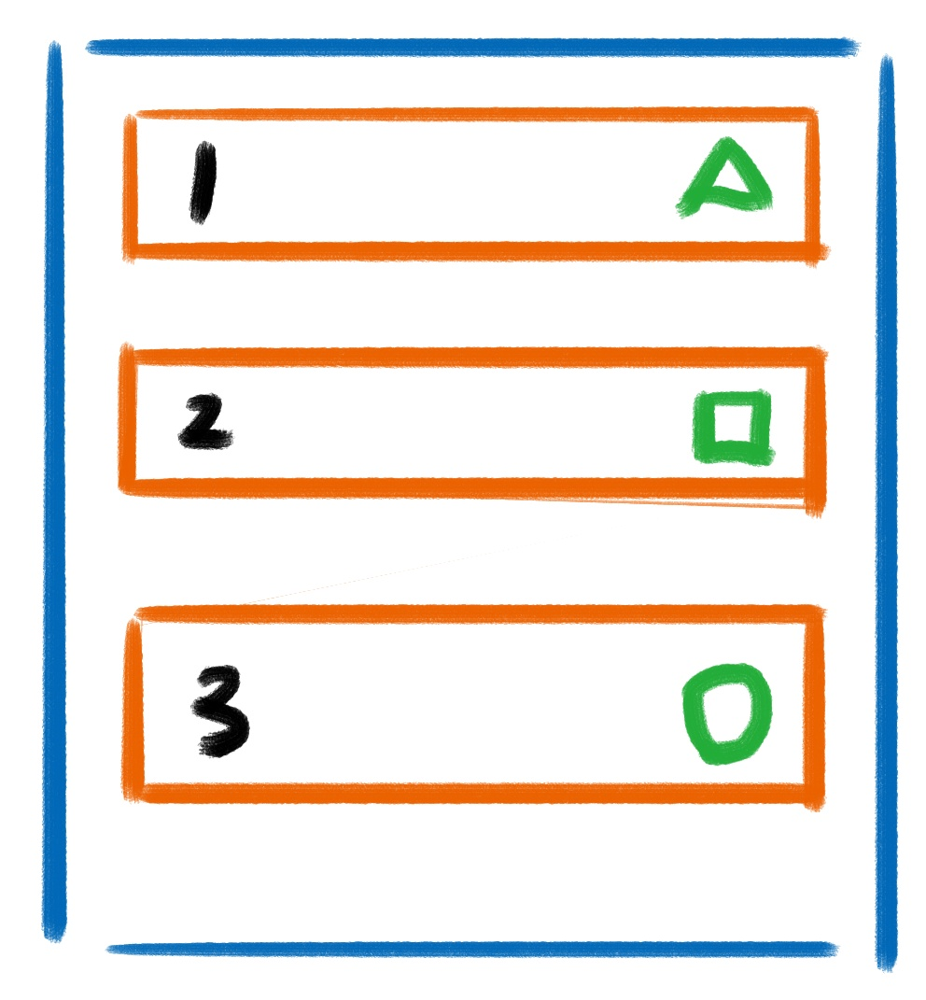
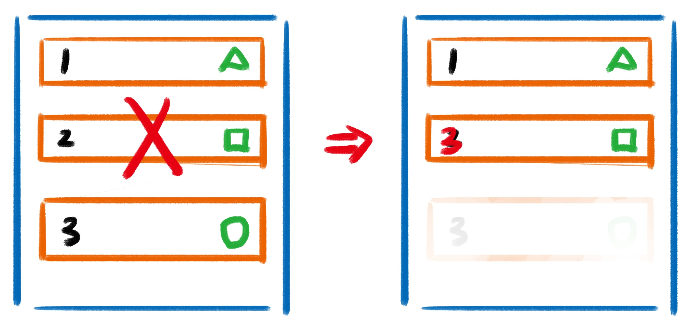

# Vue基础

## 数据与方法

 当一个 Vue 实例被创建时，它将 `data` 对象中的所有的 property 加入到 Vue 的**响应式系统**中。当这些 property 的值发生改变时，视图将会产生“响应”，即匹配更新为新的值。当这些数据改变时，视图会进行重渲染。


**需要注意：**只有当实例被创建时就已经存在于 `data` 中的 property 才是**响应式**的。


也就是说如果你添加一个新的 property，那么后续对于该 property 所作的改动将不会触发任何视图的更新。如果你知道你会在晚些时候需要一个 property，但是一开始它为空或不存在，那么你仅需要设置一些初始值。


当使用 Object.freeze\(\) 对属性进行冻结时，Vue 系统将不再追踪 property 的变化


#### 为什么 data 需要是函数？

组件复用时所有组件实例都会共享 `data`，如果 `data` 是对象的话，就会造成一个组件修改 `data` 以后会影响到其他所有组件，所以需要将 `data` 写成函数，每次用到就调用一次函数获得新的数据。

当我们使用 `new Vue()` 的方式的时候，无论我们将 `data` 设置为对象还是函数都是可以的，因为 `new Vue()` 的方式是生成一个根组件，该组件不会复用，也就不存在共享 `data` 的情况了。

## **模板**

模板这块没有特别需要说明的，只有一处需要注意一下：

有些 HTML 元素，诸如 `<ul>`、`<ol>`、`<table>` 和 `<select>`，对于哪些元素可以出现在其内部是有严格限制的。而有些元素，诸如 `<li>`、`<tr>` 和 `<option>`，只能出现在其它某些特定的元素内部。

这会导致我们使用这些有约束条件的元素时遇到一些问题。例如：

```markup
<table>
  <tr is="blog-post-row"></tr>
</table>
```

这个自定义组件 `<blog-post-row>` 会被作为无效的内容提升到外部，并导致最终渲染结果出错。幸好这个特殊的 `is` attribute 给了我们一个变通的办法：

```markup
<table>
  <tr is="blog-post-row"></tr>
</table>
```

需要注意的是**如果我们从以下来源使用模板的话，这条限制是**_**不存在**_**的**：

* 字符串 \(例如：`template: '...'`\)
* 单文件组件 \(`.vue`\)
* `<script type="text/x-template">`

## 生命周期


 每个 Vue 实例在被创建时都要经过一系列的初始化过程——例如，需要设置数据监听、编译模板、将实例挂载到 DOM 并在数据变化时更新 DOM 等。同时在这个过程中也会运行一些叫做**生命周期钩子**的函数，这给了用户在不同阶段添加自己的代码的机会。


### **Vue 的全部生命周期钩子（非 SSR）：**

* **beforeCreate**

  在实例初始化之后，数据观测 \(data observer\) 和 event/watcher 事件配置之前被调用。

* **created**

  在实例创建完成后被立即调用。在这一步，实例已完成以下的配置：数据观测 \(data observer\)，property 和方法的运算，watch/event 事件回调。然而，挂载阶段还没开始，`$el` property 目前尚不可用。

* **beforeMount**

  在挂载开始之前被调用：相关的 `render` 函数首次被调用。

* **mounted**

  实例被挂载后调用，这时 `el` 被新创建的 `vm.$el` 替换了。如果根实例挂载到了一个文档内的元素上，当 `mounted` 被调用时 `vm.$el` 也在文档内。

  **注意：** `mounted` **不会**保证所有的子组件也都一起被挂载。如果你希望等到整个视图都渲染完毕，可以在 `mounted` 内部使用 [vm.$nextTick](https://cn.vuejs.org/v2/api/#vm-nextTick)。

* **beforeUpdate**

  数据更新时调用，发生在虚拟 DOM 打补丁之前。这里适合在更新之前访问现有的 DOM，比如手动移除已添加的事件监听器。

* **updated**

  由于数据更改导致的虚拟 DOM 重新渲染和打补丁，在这之后会调用该钩子。

  当这个钩子被调用时，组件 DOM 已经更新，所以你现在可以执行依赖于 DOM 的操作。**然而在大多数情况下，你应该避免在此期间更改状态**。如果要相应状态改变，通常最好使用[计算属性](https://cn.vuejs.org/v2/api/#computed)或 [watcher](https://cn.vuejs.org/v2/api/#watch) 取而代之。

  **注意：** `updated` **不会**保证所有的子组件也都一起被重绘。如果你希望等到整个视图都重绘完毕，可以在 `updated` 里使用 [vm.$nextTick](https://cn.vuejs.org/v2/api/#vm-nextTick)。

* **activated**

  被 keep-alive 缓存的组件激活时调用。

* **deactivated**

  被 keep-alive 缓存的组件停用时调用。

* **beforeDestroy**

  实例销毁之前调用。在这一步，实例仍然完全可用。

* **destroyed**

  实例销毁后调用。该钩子被调用后，对应 Vue 实例的所有指令都被解绑，所有的事件监听器被移除，所有的子实例也都被销毁。

* **errorCaptured**

   当捕获一个来自子孙组件的错误时被调用。此钩子会收到三个参数：错误对象、发生错误的组件实例以及一个包含错误来源信息的字符串。此钩子可以返回 `false` 以阻止该错误继续向上传播。


**需要注意：**如果使用 Vue 的服务端渲染框架比如：Nestjs，那么生命周期中只有：**beforeCreate、created 和 errorCaptured** 有效。因为服务端渲染只负责第一屏，渲染完成后，后续的 DOM 挂载、数据变更、销毁等，均由浏览器接管。



 **需要注意：**所有的生命周期钩子自动绑定 `this` 上下文到实例中，因此你可以访问数据，对 property 和方法进行运算。这意味着**你不能使用箭头函数来定义一个生命周期方法** \(例如 `created: () => this.fetchTodos()`\)。这是因为箭头函数绑定了父上下文，因此 `this` 与你期待的 Vue 实例不同，`this.fetchTodos` 的行为未定义。


下图是一个 Vue 实例的生命周期图谱：


### 关于Vue生命周期的总结：

在 `beforeCreate` 钩子函数调用的时候，是获取不到 `props` 或者 `data` 中的数据的，因为这些数据的初始化都在 `initState` 中。

然后会执行 `created` 钩子函数，在这一步的时候已经可以访问到之前不能访问到的数据，但是这时候组件还没被挂载，所以是看不到的。

接下来会先执行 `beforeMount` 钩子函数，开始创建 VDOM，最后执行 `mounted` 钩子，并将 VDOM 渲染为真实 DOM 并且渲染数据。`mounted` **不会**保证所有的子组件也都一起被挂载。

接下来是数据更新时会调用的钩子函数 `beforeUpdate` 和 `updated`，这两个钩子函数分别在数据更新前和更新后会调用。

另外还有 `keep-alive` 独有的生命周期，分别为 `activated` 和 `deactivated` 。用 `keep-alive` 包裹的组件在切换时不会进行销毁，而是缓存到内存中并执行 `deactivated` 钩子函数，命中缓存渲染后会执行 `actived` 钩子函数。

最后就是销毁组件的钩子函数 `beforeDestroy` 和 `destroyed`。前者适合移除事件、定时器等等，否则可能会引起内存泄露的问题。然后进行一系列的销毁操作。

## 计算属性和侦听器

### 计算属性的使用场景：


当绑定在模板中的数据需要**依赖其他属性值进行计算，或者需要经过一些复杂计算、特殊处理才能渲染到页面上的时候**，我们可以使用计算属性：**computed**


### **计算属性的特性：**


计算属性可以让你的绑定值依赖其他值的变化来进行动态计算，并且会根据依赖值进行缓存，只有当依赖值变化才会返回新的计算内容。


### 计算属性和侦听器的区别：


**computed** 是计算属性，依赖其他属性计算值，并且 **computed** 的值有缓存，只有当计算值变化才会返回内容。

**watch** 监听到值的变化就会执行回调，在回调中可以进行一些逻辑操作。

所以一般来说需要依赖别的属性来动态获得值的时候可以使用 **computed**，对于监听到值的变化需要做一些复杂业务逻辑的情况可以使用 **watch**。


计算属性和侦听器还支持对象形式的写法：

```javascript
// watch
vm.$watch('obj', {
    // 深度遍历
    deep: true,
    // 立即触发
    immediate: true,
    // 执行的函数
    handler: function(val, oldVal) {}
})

// computed
var vm = new Vue({
  data: { a: 1 },
  computed: {
    aPlus: {
      // this.aPlus 时触发
      get: function () {
        return this.a + 1
      },
      // this.aPlus = 1 时触发
      set: function (v) {
        this.a = v - 1
      }
    }
  }
});
```


设置侦听器 deep 为 true，则能开启对于对象属性的深度监听模式，也就是说，对象下的子属性发生变动，侦听器一样能够监测到变化并且触发。


### 计算属性和方法的区别：

有的时候，计算属性和方法（methods）都可以达到相同的效果，那么它们之间的区别是什么呢？


 **计算属性是基于它们的响应式依赖进行缓存的**。只在相关响应式依赖发生改变时它们才会重新求值。这就意味着只要依赖值还没有发生改变，多次访问计算属性会立即返回之前的计算结果，而不必再次执行函数。

而 相比之下，每当触发重新渲染时，调用方法将**总会**再次执行函数，这是有性能损耗的。


## Class 与 Style 绑定

### 自动添加前缀

当 `v-bind:style` 使用需要添加浏览器引擎前缀的 CSS property 时，如 `transform`，Vue.js 会自动侦测并添加相应的前缀。

## 条件渲染

### v-show 与 v-if 区别

`v-show` 只是在 `display: none` 和 `display: block` 之间切换。无论初始条件是什么都会被渲染出来，后面只需要切换 CSS，DOM 还是一直保留着的。所以总的来说 `v-show` 在初始渲染时有更高的开销，但是切换开销很小，更适合于频繁切换的场景。

`v-if` 的话就得说到 Vue 底层的编译了。当属性初始为 `false` 时，组件就不会被渲染，直到条件为 `true`，并且切换条件时会触发销毁/挂载组件，所以总的来说在切换时开销更高，更适合不经常切换的场景。

并且基于 `v-if` 的这种惰性渲染机制，可以在必要的时候才去渲染组件，减少整个页面的初始渲染开销。

### 用 `key` 管理可复用的元素

`Vue` 的 `key` 这个东西官网上说的官方解释有些抽象，推荐大家看：[Vue2.0 v-for 中 :key 到底有什么用？](https://www.zhihu.com/question/61064119/answer/766607894)

**简单来说：**

* 如果这个元素没有加上 `key`，那么在 Vue 下一次更新视图的时候，它就会尽可能地将该元素进行复用，而不是重新创造一个新的元素将其替换。典型的场景是：表单登录，用户可以选择微信号或者手机号登录，当用户输入账号后忽然想切换登录方式，代码里虽然是使用的 v-if 进行了微信号和手机号两个 input 之间的切换，但是之前填写的登录账号信息依然会保留下来，这个就是 Vue 对 Input 标签进行了复用。
* 如果这个元素上加了唯一的 `key` ，就等于说给这个元素及其子元素 / 子组件加上了一个唯一的 id 标识，那么 Vue 在下一次更新视图的时候，就能够识别出哪些元素是被修改了，哪些元素是被删除掉了，从而更有针对性地选择复用还是重建元素，而不是直接一股脑地能复用就复用。

**官网解释：**

`key` 的特殊 attribute 主要用在 Vue 的虚拟 DOM 算法，在新旧 nodes 对比时辨识 VNodes。如果不使用 key，Vue 会使用一种 **最大限度减少动态元素** 并且 **尽可能的尝试就地修改/复用相同类型元素** 的算法。而使用 key 时，**它会基于 key 的变化重新排列元素顺序，并且会移除 key 不存在的元素**。

有相同父元素的子元素必须有**独特的 key**。重复的 key 会造成渲染错误。

最常见的用例是结合 `v-for`：

```markup
<ul>
  <li v-for="item in items" :key="item.id">...</li>
</ul>
```

**它也可以用于强制替换元素/组件而不是重复使用它**。当你遇到如下场景时它可能会很有用：

* **完整地触发组件的生命周期钩子**
* **触发过渡**

例如：

```markup
<transition>
  <span :key="text">{{ text }}</span>
</transition>
```

当 `text` 发生改变时，`<span>` 总是会被替换而不是被修改，因此会触发过渡。

## 列表渲染

这里的 `v-for` 指令就涉及到上面所说的 `key` 的问题。

假设有一个列表，列表有三个子组件，自组件没有加唯一 `key` 值，每个子组件里面有一个「有状态的」孙子组件。



现在用户点击删除按钮，删除掉第二项，会出现以下结果：Vue 识别自组件 **2** 的名称被修改为 **3** 但是其他的东西都会进行复用，包括自组件，然后删除原来的 **3** 组件及其自组件。这就出现了问题。




 **不要使用 index 索引作为组件的 key！**因为，这样的话，当你删除了一项比如第二项，那么第三项组件的 key 就变成了 2 ，Vue 在进行 VNodes 比对的时候，还会认为是你只是将组件 2 的名称修改成了组件 3，然后还是会复用，于是还是会出现上面的问题。


### 数组的更新监测

Vue 将被侦听的数组的变更方法进行了包裹，所以它们也将会触发视图更新。这些被包裹过的方法包括：

* `push()`
* `pop()`
* `shift()`
* `unshift()`
* `splice()`
* `sort()`
* `reverse()`


 由于 JavaScript 的限制，Vue **不能检测** 数组和对象的变化。


### 不要将 `v-for` 与 `v-if` 一同使用


 **永远不要把 `v-if` 和 `v-for` 同时用在同一个元素上。**


当 Vue 处理指令时，`v-for` 比 `v-if` 具有更高的优先级，所以这个模板：

```markup
<ul>
  <li
    v-for="user in users"
    v-if="user.isActive"
    :key="user.id"
  >
    {{ user.name }}
  </li>
</ul>
```

将会经过如下运算：

```javascript
this.users.map(function (user) {
  if (user.isActive) {
    return user.name
  }
})
```

因此哪怕我们只渲染出一小部分用户的元素，也得在每次重渲染的时候遍历整个列表，不论活跃用户是否发生了变化。

通过将其更换为在如下的一个计算属性上遍历：

```javascript
computed: {
  activeUsers: function () {
    return this.users.filter(function (user) {
      return user.isActive
    })
  }
}
```

一般我们在两种常见的情况下会倾向于这样做：

* 为了过滤一个列表中的项目 \(比如 `v-for="user in users" v-if="user.isActive"`\)。**在这种情形下，请将 `users` 替换为一个计算属性 \(比如 `activeUsers`\)，让其返回过滤后的列表。**
* 为了避免渲染本应该被隐藏的列表 \(比如 `v-for="user in users" v-if="shouldShowUsers"`\)。**这种情形下，请将 `v-if` 移动至容器元素上 \(比如 `ul`、`ol`\)。**


 **所以，永远不要这么写：**

\*\*\*\*

```markup
<ul>
  <li
    v-for="user in users"
    v-if="user.isActive"
    :key="user.id"
  >
    {{ user.name }}
  </li>
</ul>
```

```markup
<ul>
  <li
    v-for="user in users"
    v-if="shouldShowUsers"
    :key="user.id"
  >
    {{ user.name }}
  </li>
</ul>
```



**你可以这么写：**

\*\*\*\*

```markup
<ul>
<!-- activeUsers 是计算属性过滤后的有效用户列表 -->
  <li
    v-for="user in activeUsers"
    :key="user.id"
  >
    {{ user.name }}
  </li>
</ul>
```

```markup
<ul v-if="shouldShowUsers">
  <li
    v-for="user in users"
    :key="user.id"
  >
    {{ user.name }}
  </li>
</ul>
```


## 事件

事件处理这块可能是 Vuer 用的最多的东西之一，大部分内容大家可能也了解，就没什么好说的了，就大概总结一下吧。

在 Vue 中有下面几种事件的写法：

* **内联写法：**

  ```markup
  <div id="example-1">
    <button v-on:click="counter += 1">Add 1</button>
    <p>The button above has been clicked {{ counter }} times.</p>
  </div>
  ```

* **方法名写法**，这种写法，默认会传入一个 DOM 的原生事件对象作为事件处理函数的第一个参数

  ```markup
  <div id="example-2">
    <!-- `greet` 是在下面定义的方法名 -->
    <button v-on:click="greet">Greet</button>
  </div>
  ```

  ```javascript
    // 在 `methods` 对象中定义方法
    methods: {
      greet: function (event) {
        // `this` 在方法里指向当前 Vue 实例
        alert('Hello ' + this.name + '!')
        // `event` 是原生 DOM 事件
        if (event) {
          alert(event.target.tagName)
        }
      }
    }
  ```

* **内联语句中直接调用：**

  ```markup
  <div id="example-3">
    <button v-on:click="say('hi')">Say hi</button>
    <button v-on:click="say('what')">Say what</button>
  </div>
  ```

  > 有时也需要在内联语句处理器中访问原始的 DOM 事件。可以用特殊变量 `$event` 把它传入方法：

  ```markup
  <button v-on:click="warn('Form cannot be submitted yet.', $event)">
    Submit
  </button>
  ```

### 事件修饰符

这块不是面试的重点，大家大概看一下文档了解就好：[事件处理——事件修饰符](https://cn.vuejs.org/v2/guide/events.html#%E4%BA%8B%E4%BB%B6%E4%BF%AE%E9%A5%B0%E7%AC%A6)。

## 双向绑定 v-model

### v-model 的本质——语法糖

 你可以用 `v-model` 指令在表单 `<input>`、`<textarea>` 及 `<select>` 元素上创建双向数据绑定。其实，`v-model` 本质上只是 `v-bind:value` 和 `v-on:input` 的语法糖而已：

使用 `v-model`：

```markup
<input v-model="val" />
```

等价于：

```markup
<input :value="val" @input="evt => val = evt.target.value" />
```

`v-model` 语法糖在内部为不同的输入元素使用不同的 property 并抛出不同的事件：

* text 和 textarea 元素使用 `value` property 和 `input` 事件；
* checkbox 和 radio 使用 `checked` property 和 `change` 事件；
* select 字段将 `value` 作为 prop 并将 `change` 作为事件。

### v-model 修饰符

这块内容面试不太可能问到，不过作为平时开发的小技巧可以学习一下。

#### `.lazy` <a id="lazy"></a>

在默认情况下，`v-model` 在每次 `input` 事件触发后将输入框的值与数据进行同步 \(除了[上述](https://cn.vuejs.org/v2/guide/forms.html#vmodel-ime-tip)输入法组合文字时\)。你可以添加 `lazy` 修饰符，从而转为在 `change` 事件\_之后\_进行同步：

```markup
<!-- 在“change”时而非“input”时更新 -->
<input v-model.lazy="msg">
```

#### `.number` <a id="number"></a>

如果想自动将用户的输入值转为数值类型，可以给 `v-model` 添加 `number` 修饰符：

```markup
<input v-model.number="age" type="number">
```

这通常很有用，因为即使在 `type="number"` 时，HTML 输入元素的值也总会返回字符串。如果这个值无法被 `parseFloat()` 解析，则会返回原始的值。

#### `.trim` <a id="trim"></a>

如果要自动过滤用户输入的首尾空白字符，可以给 `v-model` 添加 `trim` 修饰符：

```markup
<input v-model.trim="msg">
```

### 自定义组件使用 v-model

自定义组件使用 `v-model` 的方式，和原生 DOM 上绑定的 `v-model`  方式一样，只需要组件内部对外暴露 **`value prop`** ，并且组件内部向外发射 **`input`** 事件即可。


**注意：**一个组件上的 `v-model` 默认会利用名为 `value` 的 prop 和名为 `input` 的事件，但是像单选框、复选框等类型的输入控件可能会将 `value` attribute 用于不同的目的。


```markup
<custom-input v-model="searchText"></custom-input>
```

等价于

```markup
<custom-input
  v-bind:value="searchText"
  v-on:input="searchText = $event"
></custom-input>
```

组件内部

```javascript
Vue.component('custom-input', {
  props: ['value'],
  template: `
    <input
      v-bind:value="value"
      v-on:input="$emit('input', $event.target.value)"
    >
  `
})
```


