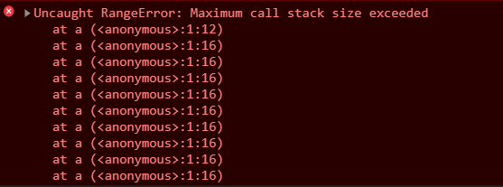

# 执行上下文

### 什么是执行上下文

当 `JS` 引擎解析到可执行代码片段（通常是函数调用阶段）的时候，就会先做一些执行前的准备工作，这个 **“准备工作”**，就叫做 **"执行上下文\(execution context 简称 `EC`\)"** 或者也可以叫做**执行环境**。


**执行上下文** 为我们的可执行代码块提供了执行前的必要准备工作，例如变量对象的定义、作用域链的扩展、提供调用者的对象引用等信息。


### 执行上下文的类型

`javascript` 中有三种执行上下文类型，分别是：

* **全局执行上下文**——这是默认或者说是最基础的执行上下文，一个程序中只会存在一个全局上下文，

  它在整个 `javascript` 脚本的生命周期内都会存在于执行堆栈的最底部不会被栈弹出销毁。全局上下文会生成一个全局对象（以浏览器环境为例，这个全局对象是 `window`），并且将 `this` 值绑定到这个全局对象上。

* **函数执行上下文**——每当一个函数被调用时，都会创建一个新的函数执行上下文（不管这个函数是不是被重复调用的）
* **Eval 函数执行上下文**—— 执行在 `eval` 函数内部的代码也会有它属于自己的执行上下文，但由于并不经常使用 `eval`，所以在这里不做分析。

### 执行上下文的内容

执行上下文是一个抽象的概念，我们可以将它理解为一个 `object` ，一个执行上下文里包括以下内容：

1. 变量对象
2. 活动对象
3. 作用域链
4. 调用者信息

#### 变量对象（`variable object` 简称 `VO`）

> 原文：Every execution context has associated with it a variable object. Variables and functions declared in the source text are added as properties of the variable object. For function code, parameters are added as properties of the variable object.

每个执行环境文都有一个表示变量的对象——**变量对象**，全局执行环境的变量对象始终存在，而函数这样局部环境的变量，只会在函数执行的过程中存在，在函数被调用时且在具体的函数代码运行之前，JS 引擎会用当前函数的**参数列表**（`arguments`）初始化一个 “变量对象” 并将当前执行上下文与之关联 ，函数代码块中声明的 **变量** 和 **函数** 将作为属性添加到这个变量对象上。



有一点需要注意，只有**函数声明**（`function declaration`）会被加入到变量对象中，而**函数表达式**（`function expression`）会被忽略。


```javascript
// 这种叫做函数声明，会被加入变量对象
function a () {}

// b 是变量声明，也会被加入变量对象，但是作为一个函数表达式 _b 不会被加入变量对象
var b = function _b () {}
```


全局执行上下文和函数执行上下文中的变量对象还略有不同，它们之间的差别简单来说：

1. **全局上下文中的变量对象就是全局对象**，以浏览器环境来说，就是 `window` 对象。
2. **函数执行上下文中的变量对象内部定义的属性，是不能被直接访问的**，只有当函数被调用时，变量对象（VO）被激活为活动对象（AO）时，我们才能访问到其中的属性和方法。


#### 活动对象（`activation object` 简称 `AO`）

> 原文：When control enters an execution context for function code, an object called the activation object is created and associated with the execution context. The activation object is initialised with a property with name arguments and attributes { DontDelete }. The initial value of this property is the arguments object described below. The activation object is then used as the variable object for the purposes of variable instantiation.

函数进入执行阶段时，原本不能访问的变量对象被激活成为一个活动对象，自此，我们可以访问到其中的各种属性。


其实变量对象和活动对象是一个东西，只不过处于不同的状态和阶段而已。


#### 作用域链（`scope chain`）


**作用域** 规定了如何查找变量，也就是确定当前执行代码对变量的访问权限。当查找变量的时候，会先从当前上下文的变量对象中查找，如果没有找到，就会从父级（词法层面上的父级）执行上下文的变量对象中查找，一直找到全局上下文的变量对象，也就是全局对象。这样由多个执行上下文的变量对象构成的链表就叫做 **作用域链**。


函数的作用域在函数创建时就已经确定了。当函数创建时，会有一个名为 `[[scope]]` 的内部属性保存所有父变量对象到其中。当函数执行时，会创建一个执行环境，然后通过复制函数的 `[[scope]]`  属性中的对象构建起执行环境的作用域链，然后，变量对象 `VO` 被激活生成 `AO` 并添加到作用域链的前端，完整作用域链创建完成：

```javascript
Scope = [AO].concat([[Scope]]);
```

#### 当前可执行代码块的调用者（this）

如果当前函数被作为对象方法调用或使用 `bind` `call` `apply` 等 `API` 进行委托调用，则将当前代码块的调用者信息（`this value`）存入当前执行上下文，否则默认为全局对象调用。


关于 `this` 的创建细节，有点烦，有兴趣的话可以进入 [传送门](https://github.com/mqyqingfeng/Blog/issues/7) 学习。


#### 执行上下文数据结构模拟

如果将上述一个完整的执行上下文使用代码形式表现出来的话，应该类似于下面这种：

```javascript
executionContext：{
    [variable object | activation object]：{
        arguments,
        variables: [...],
        funcions: [...]
    },
    scope chain: variable object + all parents scopes
    thisValue: context object
}
```

### 执行上下文的生命周期

执行上下文的生命周期有三个阶段，分别是：

* 创建阶段
* 执行阶段
* 销毁阶段

#### 创建阶段

函数执行上下文的创建阶段，发生在函数调用时且在执行函数体内的具体代码之前，在创建阶段，JS 引擎会做如下操作：

* 用当前函数的**参数列表**（`arguments`）初始化一个 “变量对象” 并将当前执行上下文与之关联 ，函数代码块中声明的 **变量** 和 **函数** 将作为属性添加到这个变量对象上。**在这一阶段，会进行变量和函数的初始化声明，变量统一定义为 `undefined` 需要等到赋值时才会有确值，而函数则会直接定义**。


  > 有没有发现这段加粗的描述非常熟悉？没错，这个操作就是  **变量声明提升**（变量和函数声明都会提升，但是函数提升更靠前）。

* 构建作用域链（前面已经说过构建细节）
* 确定 `this` 的值

#### 执行阶段

执行阶段中，JS 代码开始逐条执行，在这个阶段，JS  引擎开始对定义的变量赋值、开始顺着作用域链访问变量、如果内部有函数调用就创建一个新的执行上下文压入执行栈并把控制权交出……

#### 销毁阶段

一般来讲当函数执行完成后，当前执行上下文（局部环境）会被弹出执行上下文栈并且销毁，控制权被重新交给执行栈上一层的执行上下文。


注意这只是一般情况，闭包的情况又有所不同。


闭包的定义：**有权访问另一个函数内部变量的函数。**简单说来，如果一个函数被作为另一个函数的返回值，并在外部被引用，那么这个函数就被称为闭包。

```javascript
function funcFactory () {
    var a = 1;
    return function () {
        alert(a);
    }
}

// 闭包
var sayA = funcFactory();
sayA();
```

当闭包的父包裹函数执行完成后，父函数本身执行环境的作用域链会被销毁，但是由于闭包的作用域链仍然在引用父函数的变量对象，导致了父函数的变量对象会一直驻存于内存，无法销毁，除非闭包的引用被销毁，闭包不再引用父函数的变量对象，这块内存才能被释放掉。过度使用闭包会造成 **内存泄露** 的问题，这块等到闭包章节再做详细分析。

### 执行上下文栈

当一段脚本运行起来的时候，可能会调用很多函数并产生很多函数执行上下文，那么问题来了，这些执行上下文该怎么管理呢？为了解决这个问题，`javascript` 引擎就创建了 “执行上下文栈” （`Execution context stack` 简称 `ECS`）来管理执行上下文。

顾名思义，执行上下文栈是栈结构的，因此遵循 `LIFO`（后进先出）的特性，代码执行期间创建的所有执行上下文，都会交给执行上下文栈进行管理。

当 JS 引擎开始解析脚本代码时，会首先创建一个**全局执行上下文**，压入栈底（这个全局执行上下文从创建一直到程序销毁，都会存在于栈的底部）。

每当引擎发现一处函数调用，就会创建一个新的**函数执行上下文**压入栈内，并将控制权交给该上下文，待函数执行完成后，即将该执行上下文从栈内弹出销毁，将控制权重新给到栈内上一个执行上下文。


### 递归和栈溢出

在了解了调用栈的运行机制后，我们可以考虑一个问题，这个执行上下文栈可以被无限压栈吗？很显然是不行的，执行栈本身也是有容量限制的，当执行栈内部的执行上下文对象积压到一定程度如果继续积压，就会报 “栈溢出（`stack overflow`）” 的错误。栈溢出错误经常会发生在 **递归** 中。




程序调用自身的编程技巧称为**递归（ `recursion`）**。


递归的使用场景，通常是在运行次数未知的情况下，程序会设定一个限定条件，除非达到该限定条件否则程序将一直调用自身运行下去。递归的适用场景非常广泛，比如累加函数：

```javascript
// 求 1~num 的累加，此时 num 由外部传入，是未知的
function recursion (num) {
    if (num === 0) return num;
    return recursion(num - 1) + num;
}

recursion(100) // => 5050
recursion(1000) // => 500500
recursion(10000) // => 50005000
recursion(100000) // => Uncaught RangeError: Maximum call stack size exceeded
```

从代码中可以看到，这个递归的累加函数，在计算 1 ~ 100000 的累加和的时候，执行栈就崩不住了，触发了栈溢出的错误。

### 尾递归优化

针对递归存在的 “爆栈” 问题，我们可以学习一下 **尾递归优化**。“递归” 我们已经了解了，那么 “尾” 是什么意思呢？“尾” 的意思是 “尾调用（`Tail Call`）”，即**函数的最后一步是返回一个函数的运行结果：**

```javascript
// 尾调用正确示范1
function a(x){
  return b(x);
}

// 尾调用正确示范2
// 尾调用不一定要写在函数的最后为止，只要保证执行时是最后一部操作就行了。
function c(x) {
  if (x > 0) {
    return d(x);
  }
  return e(x);
}
```

尾调用之所以与其他调用不同，就在于它的特殊的调用位置。尾调用由于是函数的最后一步操作，所以不需要保留外层函数的相关信息，因为调用位置、内部变量等信息都不会再用到了，只要直接用内层函数的调用记录，取代外层函数的调用记录就可以了，这样一来，运行尾递归函数时，执行栈永远只会新增一个上下文。

我们可以使用尾调用的方式改写下上面的累加递归：

```javascript
// 尾递归优化
function recursion (num, sum = 0) {
    if (num === 0) return sum;
    return recursion(num - 1, sum + num);
}

recursion(100000) // => Uncaught RangeError: Maximum call stack size exceeded
```


运行之后怎么还是报错了 😳 ？？裂开了呀。。。  

其实，尾递归优化这种东西，现在没有任何一个浏览器是支持的，`babel` 编译也不支持。那 `nodejs` 里的 `V8` 引擎呢？它做好了，但是不给你用，官方回答如下：

> Proper tail calls have been implemented but not yet shipped given that a change to the feature is currently under discussion at TC39.

理由呢，它也很有道理：

* 有可能由于开发者水平原因，自己写的尾递归是死循环，然后引擎层面它优化掉了，又不报错，就裂开。
* 堆栈信息会在优化的过程中丢失，开发者调试非常困难，就很烦。

总之，尾递归优化这个东西暂时还是不要想用到了，不过先了解个概念也是好的。

### 小试牛刀

在网上找了几条执行上下文比较典型的面试题，大家可以试一试：

**第一题：**

```javascript
var foo = function () {
    console.log('foo1');
}

foo();  // foo1

var foo = function () {
    console.log('foo2');
}

foo(); // foo2
```

第一题没什么，应该能写出来。

**第二题：**

```javascript
foo();  // foo2

var foo = function foo() {
    console.log('foo1');
}

function foo() {
    console.log('foo2');
}

foo(); // foo1
```

全局执行环境自动创建，过程中生成了变量对象进行函数变量的属性收集，造成了函数声明提升、变量声明提升。由于函数声明提升更加靠前，且如果 `var` 定义变量的时候发现已有同名函数定义则跳过变量定义，上面的代码其实可以写成下面这样：

```javascript
function foo () {
    console.log('foo2');
}

foo();  // foo2

foo = function foo() {
    console.log('foo1');
};

foo();  // foo1
```

**第三题：**

```javascript
var foo = 1;
function bar () {
    console.log(foo); // undefined
    var foo = 10;
    console.log(foo); // 10
}

bar();
```

`bar` 函数运行，内部变量申明提升，当执行代码块中有访问变量时，**先查找本地作用域**，找到了 `foo` 为 `undefined` ，打印出来。然后 `foo` 被赋值为 `10` ，打印出 `10`。

**第四题：**

```javascript
var foo = 1;
function bar () {
    console.log(foo);
    foo = 2;
}
bar();  // => 1
console.log(foo); // => 2
```

这题也是考察的作用域链查找，`bar` 里操作的 `foo` 其实是上层作用域的变量。

**第五题：**

```javascript
var foo = 1;
function bar (foo) {
    console.log(foo);
    foo = 234;
}
bar(123);  // => 123
console.log(foo); // => 1
```

### 相关参考

* [JavaScript 深入之执行上下文](https://github.com/mqyqingfeng/Blog/issues/4)
* [JavaScript深入之变量对象](https://github.com/mqyqingfeng/Blog/issues/5)
* \*\*\*\*[图解Javascript——变量对象和活动对象](https://www.cnblogs.com/ivehd/p/vo_ao.html)
* [\[译\] 理解 JavaScript 中的执行上下文和执行栈](https://juejin.im/post/5ba32171f265da0ab719a6d7#heading-1)
* [理解Javascript之执行上下文\(Execution Context**\)**](https://www.cnblogs.com/MinLee/p/5862271.html)\*\*\*\*
* [知乎：JS中的作用域链是在什么时候建立的？](https://www.zhihu.com/question/36751764)
* [VO、AO、执行环境和作用域链](https://www.cnblogs.com/lulin1/p/9712311.html)
* [尾调用优化](http://www.ruanyifeng.com/blog/2015/04/tail-call.html)
* [JavaScript调用栈、尾递归和手动优化](https://www.jianshu.com/p/3182429e26b5)

