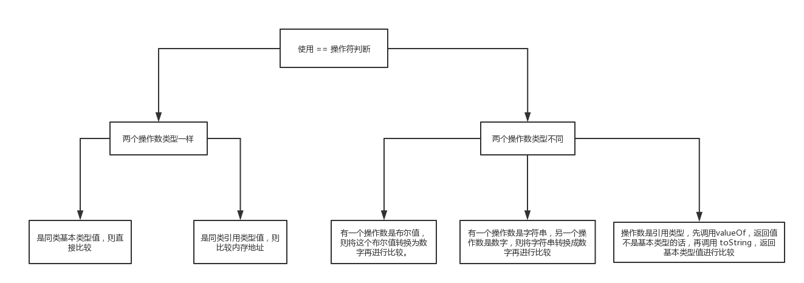

# javascript 类型转换

### 关于 JS 类型转换

JS 有六种基本数据类型：

* `number`
* `string`
* `boolean`
* `undefined`
* `null`
* `symbol`\(`ES6` 新加入\)

以及一种引用类型：

* `object`

当这些不同类型的数据之间，需要通过逻辑操作符进行判断，或者进行运算操作时，就会触发 JS 的隐性类型转换机制，对不同类型的数据先进行转换操作，再运行相关逻辑。

### 类型转换规则

JS 种的类型转换，只有如下三种情况：

* 转为布尔值
* 转为数字
* 转为字符串

以下是各种数据类型之间相互转换的表格：

| 原始值类型 | 目标值类型 | 结果 |
| :---: | :---: | :---: |
| boolean | 布尔值 | 本身值，false 就为 false ，true 就为 true |
| number | 布尔值 | 0 和 NaN 为 false 否则都为 true |
| string | 布尔值 | 除了空字符串为 false 其他都为 true |
| undefined、null | 布尔值 | false |
| symbol | 布尔值 | true |
| 对象 | 布尔值 | true |
| 数组 | 布尔值 | true |

| 原始值类型 | 目标值类型 | 结果 |
| :---: | :---: | :---: |
| boolean | 字符串 | true: 'true'；false: 'false' |
| number | 字符串 | 数字字符串 |
| string | 字符串 | 字符串本身值 |
| undefined、null | 字符串 | 抛错 |
| symbol | 字符串 | symbol 字符串 |
| 对象 | 字符串 | '\[object Object\]' |
| 数组 | 字符串 | 空数组转为空字符串，否则转为由逗号拼接每一项的字符串 |

| 原始值类型 | 目标值类型 | 结果 |
| :---: | :---: | :---: |
| boolean | 数字 | true 转换为 1，false 转换为 0 |
| number | 数字 | 数字本身 |
| string | 数字 | 除了都是数字组成的字符串，能转换成数字外，其他都是 NaN |
| null | 数字 | 0 |
| undefined | 数字 | NaN |
| symbol | 数字 | 抛错 |
| 对象 | 数字 | NaN |
| 数组 | 数字 | 空数组转换为0；只有一项（数字）的数组转换为这个数字；只有一项（空字符串、undefined、null）的数组转换为0；除上述以外情况的数组转换为 `NaN` |

### 触发 JS 隐式转换的先决条件

在下面两种情况下，将会触发 JS 的隐性类型转换机制。 1. 当使用 `==`、`&&`、`||` 等逻辑操作符进行判断时 2. 当使用 `+ - * /` 四则运算符进行操作时

下面就 `==` 和四则运算两种情况，来分析一下内部的转化机制:

#### 1. 使用 `==` 操作符进行判断时

先来看下在使用 `==` 进行判断时，隐式转换的内部机制，判断步骤如下：

**两个操作数类型一样的情况：**

1. 如果两个操作数是同类基本类型值，则直接比较
2. 如果两个操作数是同类引用类型值，则比较内存地址

   **两个操作数类型不一样的情况：**

3. 如果有一个操作数是布尔值，则将这个布尔值转换为数字再进行比较。
4. 如果有一个操作数是字符串，另一个操作数是数字，则将字符串转换成数字再进行比较
5. 如果有一个操作数是引用类型的值，则调用该实例的 `valueOf` 方法，如果得到的值不是基本类型的值，再调用该实例的 `toString` 方法，用得到的基本类型的值按照前面的规则进行匹配对比。

以上逻辑转换成流程图：



**特殊情况：**

1. `null == undefined` 判断为 `true`
2. `null` 和 `undefined` 无法转换为基本类型值
3. `NaN != NaN`  判断为 `true`，事实上，`NaN` 更像一个特例，谁都不等于

#### 2. 使用 `+` 进行判断时

1. 两个操作数都为数字时直接运行加法操作
2. 若有一方为字符串，则将两个操作数都转换成字符串，进行字符串拼接操作。
3. `true + true` / `false + false` / `null + null` 转换为数字进行加法运算
4. `undefined + undefined` 进行加法运算，结果为 `NaN`

**3. 使用除 + 号以外的四则运算符判断时**

直接进行数学运算，行就行，不行就直接 `NaN`，简单粗暴。

### 类型转换的经典面试题目

1. `[] == ![]` 输出结果是？
2. `{} == !{}` 输出结果是？
3. `1 + '1'` 输出结果是？
4. `true + true` 输出结果是？
5. `4 + []` 输出结果是？
6. `4 + {}` 输出结果是？
7. `4 + [1]` 输出结果是？
8. `4 + [1, 2, 3, 4]` 输出结果是？
9. `'a' + + 'b'`输出结果是？ 

第一题的转化逻辑如下：

```javascript
// 尝试判断，!运算符的优先级大于 ==，所以实际上这里还涉及到!的运算。
[] == ![]
// 将右边 ![] 进行转换
[] == false
// 隐式转换布尔值为数字
[] == 0
// 转换左边的 []，调用 [] 实例的 valueOf 方法
[] == 0
// valueOf 方法返回的不是基本类型值，再次调用 toString 方法
'' == 0
// 隐式转换字符串为数字
0 == 0
// 返回结果
true
```

第二题的转化逻辑如下：

```javascript
// 尝试判断，!运算符的优先级大于 ==，所以实际上这里还涉及到!的运算。
{} == !{}
// 将右边 !{} 进行转换 
{} == false
// 隐式转换布尔值为数字
{} == 0
// 转换左边的 {}，调用 {} 实例的 valueOf 方法
{} == 0
// valueOf 方法返回的不是基本类型值，再次调用 toString 方法
'[object Object]' == 0
// 隐式转换字符串为数字
NaN == 0
// 返回结果
false
```

后面的题目：

```javascript
// 第三题
1 + '1' == '1' + '1' == '11'
// 第四题
true + true == 1 + 1 == 2
// 第五题
4 + [] == '4' + '' == '4'
// 第六题
4 + {} == '4' + '[object Object]' == '4[object Object]'
// 第七题
4 + [1] == '4' + '1' == '41'
// 第八题
4 + [1, 2, 3, 4] == '4' + '1, 2, 3, 4' == '41,2,3,4'
// 第九题，稍微有点复杂，+'b'是被转换成了 NaN
'a' + + 'b' == 'a' + 'NaN' == 'aNaN'
```

> 本文参考了一些别人的观点，再加上自己手动控制台打印认证，如果有错误，欢迎指出，我即时修改。

