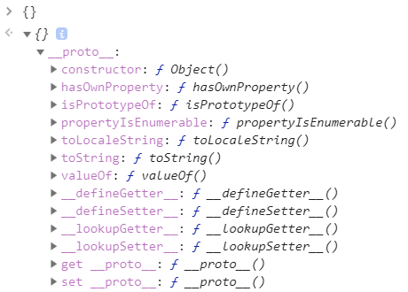
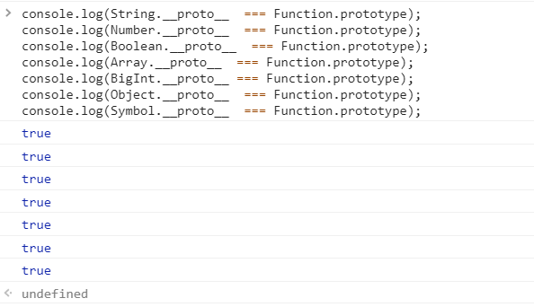
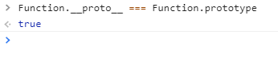

# 原型链及继承

### 原型、构造函数及原型链

#### 原型

> 当我们 new 了一个新的对象实例，明明什么都没有做，就直接可以访问 toString 、valueOf 等原生方法。那么这些方法是从哪里来的呢？答案就是原型。



在控制台打印一个空对象时，我们可以看到，有很多方法，已经“初始化”挂载在内置的 `__proto__` 对象上了。这个内置的 `__proto__` 是一个指向原型对象的指针，它会在创建一个新的引用类型对象时（显示或者隐式）自动创建，并挂载到新实例上。当我们尝试访问实例对象上的某一属性 / 方法时，如果实例对象上有该属性 / 方法时，就返回实例属性 / 方法，如果没有，就去 `__proto__` 指向的原型对象上查找对应的属性 / 方法。这就是为什么我们尝试访问空对象的 `toString` 和 `valueOf` 等方法依旧能访问到的原因，**`JavaScript` 正式以这种方式为基础来实现继承的。**

#### 构造函数

如果说实例的 `__proto__` 只是一个指向原型对象的指针，那就说明在此之前原型对象就已经创建了，那么原型对象是什么时候被创建的呢？这就要引入**“构造函数”**的概念。

其实构造函数也就只是一个普通的函数而已，如果这个函数可以使用 `new` 关键字来创建它的实例对象，那么我们就把这种函数称为 **构造函数**。

```javascript
// 普通函数
function person () {}

// 构造函数，函数首字母通常大写
function Person () {}
const person = new Person();
```

原型对象正是在构造函数被声明时一同创建的。构造函数被申明时，原型对象也一同完成创建，然后挂载到构造函数的 `prototype` 属性上：


原型对象被创建时，会自动生成一个 `constructor` 属性，指向创建它的构造函数。这样它俩的关系就被紧密地关联起来了。

> 细心的话，你可能会发现，原型对象也有自己的 `__proto__` ，这也不奇怪，毕竟万物皆对象嘛。原型对象的 \_\_proto\_\_ 指向的是 `Object.prototype`。那么 `Object.prototype.__proto__` 存不存在呢？其实是不存在的，打印的话会发现是 `null` 。这也证明了 `Object` 是 `JavaScript` 中数据类型的起源。

分析到这里，我们大概了解原型及构造函数的大概关系了，我们可以用一张图来表示这个关系：


#### 原型链

说完了原型，就可以来说说原型链了，如果理解了原型机制，原型链就很好解释了。其实上面一张图上，那条被 `__proto__` 链接起来的链式关系，就称为**原型链**。

**原型链的作用：**原型链如此的重要的原因就在于它决定了 `JavaScript` 中继承的实现方式。当我们访问一个属性时，查找机制如下：

* 访问对象实例属性，有则返回，没有就通过 `__proto__` 去它的原型对象查找。
* 原型对象找到即返回，找不到，继续通过原型对象的 \_\_proto\_\_ 查找。
* 一层一层一直找到 `Object.prototype` ，如果找到目标属性即返回，找不到就返回 `undefined`，不会再往下找，因为在往下找 `__proto__` 就是 `null` 了。

通过上面的解释，对于构造函数生成的实例，我们应该能了解它的原型对象了。JavaScript 中万物皆对象，那么构造函数肯定也是个对象，是对象就有 `__proto__` ，那么构造函数的 `__proto__` 是什么？

我们可以打印出来看一下：


现在才想起来所有的函数可以使用 `new Function()` 的方式创建，那么这个答案也就很自然了，有点意思，再来试试别的构造函数。



这也证明了，所有函数都是 `Function` 的实例。等一下，好像有哪里不对，那么 `Function.__proto__` 岂不是。。。




按照上面的逻辑，这样说的话，`Function` 岂不是自己生成了自己？其实，我们大可不必这样理解，因为作为一个 JS 内置对象，`Function` 对象在你脚本文件都还没生成的时候就已经存在了，哪里能自己调用自己，这个东西就类似于玄学中的“道”和“乾坤”，你能说明它们是谁生成的吗，天地同寿日月同庚不生不灭。。。算了，在往下扯就要写成修仙=。=

至于为什么 `Function.__proto__`  等于 `Function.prototype` 有这么几种说法：

* 为了保持与其他函数保持一致
* 为了说明一种关系，比如证明所有的函数都是 `Function` 的实例。
* 函数都是可以调用 `call` `bind` 这些内置 API 的，这么写可以很好的保证函数实例能够使用这些 API。

#### 注意点：

关于原型、原型链和构造函数有几点需要注意：

*  `__proto__` 是非标准属性，如果要访问一个对象的原型，建议使用 ES6 新增的 `Reflect.getPrototypeOf` 或者 `Object.getPrototypeOf()` 方法，而不是直接 obj.\_\_proto\_\_，因为非标准属性意味着未来可能直接会修改或者移除该属性。同理，当改变一个对象的原型时，最好也使用 `ES6` 提供的 `Reflect.setPrototypeOf` 或 `Object.setPrototypeOf`。

  ```javascript
  let target = {};
  let newProto = {};
  Reflect.getPrototypeOf(target) === newProto; // false
  Reflect.setPrototypeOf(target, newProto);
  Reflect.getPrototypeOf(target) === newProto; // true
  ```

* 函数都会有 `prototype` ，除了 `Function.prototype.bind()` 之外。
* 对象都会有 `__proto__` ，除了 `Object.prototype` 之外（其实它也是有的，之不过是 `null`）。
* Fon

### 原型继承的两种常见方式

* 组合继承：子类构造方法中用 call 调用，父类构造方法并传入参数，更改子类构造方法原型为父类实例
  * 优点：1. 实例化时可以传参，不会与父类引用属性共享
  * 缺陷: 因为更改子类构造方法时 new 了父类的实例，子类原型中会存在父类实例属性，浪费内存
* 寄生组合式继承：针对组合继承中，更改子类原型的步骤进行改进，使用 Object.create\(Parent.prototype\) 创建一个新的原型对象赋予子类

    从而解决组合继承的缺陷

组合继承

```javascript
// 组合继承实现

function Parent(value) {
    this.value = value;
}

Parent.prototype.getValue = function() {
    console.log(this.value);
}

function Child(value) {
    Parent.call(this, value)
}

Child.prototype = new Parent();

const child = new Child(1)
child.getValue();
child instanceof Parent;
```

寄生组合集成

```javascript
// 寄生组合继承实现

function Parent(value) {
    this.value = value;
}

Parent.prototype.getValue = function() {
    console.log(this.value);
}

function Child(value) {
    Parent.call(this, value)
}

Child.prototype = Object.create(Parent.prototype, {
    constructor: {
        value: Child,
        enumerable: false,
        writable: true,
        configurable: true
    }
})

const child = new Child(1)
child.getValue();
child instanceof Parent;
```

1. class 继承：class 只是语法糖，本质上还是使用构造函数的原型链继承

```javascript
class Parent {
    constructor(value) {this.value = value;}

    getValue() {console.log(this.value);}
}

class Child extends Parent {
    constructor(value) {super(value)}
}

let child = new Child(1)
child.getValue()
child instanceof Parent
```

### 相关参考

* [JavaScript 深入之从原型到原型链](https://github.com/mqyqingfeng/Blog/issues/2)

