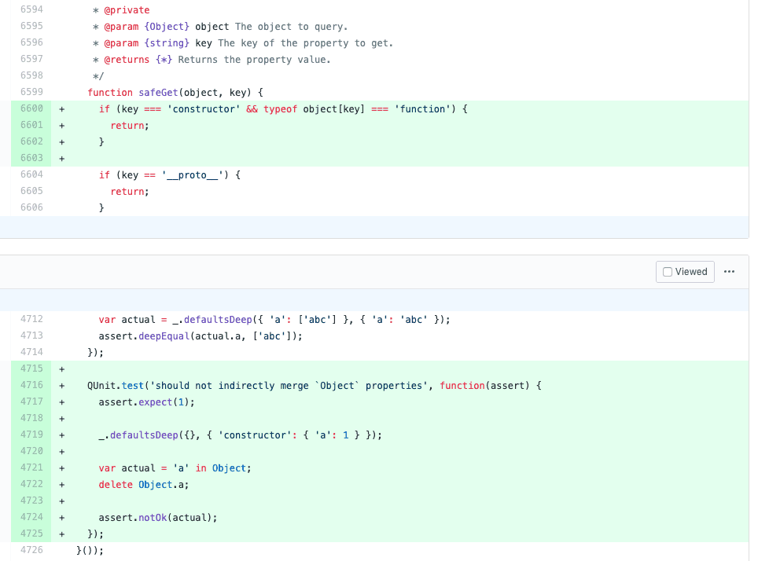

# 原型链及继承

### 原型、构造函数及原型链

#### 原型

> 当我们 new 了一个新的对象实例，明明什么都没有做，就直接可以访问 toString 、valueOf 等原生方法。那么这些方法是从哪里来的呢？答案就是原型。


在控制台打印一个空对象时，我们可以看到，有很多方法，已经“初始化”挂载在内置的 `__proto__` 对象上了。这个内置的 `__proto__` 是一个指向原型对象的指针，它会在创建一个新的引用类型对象时（显示或者隐式）自动创建，并挂载到新实例上。当我们尝试访问实例对象上的某一属性 / 方法时，如果实例对象上有该属性 / 方法时，就返回实例属性 / 方法，如果没有，就去 `__proto__` 指向的原型对象上查找对应的属性 / 方法。这就是为什么我们尝试访问空对象的 `toString` 和 `valueOf` 等方法依旧能访问到的原因，**`JavaScript` 正式以这种方式为基础来实现继承的。**

#### 构造函数

如果说实例的 `__proto__` 只是一个指向原型对象的指针，那就说明在此之前原型对象就已经创建了，那么原型对象是什么时候被创建的呢？这就要引入**“构造函数”**的概念。

其实构造函数也就只是一个普通的函数而已，如果这个函数可以使用 `new` 关键字来创建它的实例对象，那么我们就把这种函数称为 **构造函数**。

```javascript
// 普通函数
function person () {}

// 构造函数，函数首字母通常大写
function Person () {}
const person = new Person();
```

原型对象正是在构造函数被声明时一同创建的。构造函数被申明时，原型对象也一同完成创建，然后挂载到构造函数的 `prototype` 属性上：


原型对象被创建时，会自动生成一个 `constructor` 属性，指向创建它的构造函数。这样它俩的关系就被紧密地关联起来了。

> 细心的话，你可能会发现，原型对象也有自己的 `__proto__` ，这也不奇怪，毕竟万物皆对象嘛。原型对象的 \_\_proto\_\_ 指向的是 `Object.prototype`。那么 `Object.prototype.__proto__` 存不存在呢？其实是不存在的，打印的话会发现是 `null` 。这也证明了 `Object` 是 `JavaScript` 中数据类型的起源。

分析到这里，我们大概了解原型及构造函数的大概关系了，我们可以用一张图来表示这个关系：


#### 原型链

说完了原型，就可以来说说原型链了，如果理解了原型机制，原型链就很好解释了。其实上面一张图上，那条被 `__proto__` 链接起来的链式关系，就称为**原型链**。

**原型链的作用：**原型链如此的重要的原因就在于它决定了 `JavaScript` 中继承的实现方式。当我们访问一个属性时，查找机制如下：

* 访问对象实例属性，有则返回，没有就通过 `__proto__` 去它的原型对象查找。
* 原型对象找到即返回，找不到，继续通过原型对象的 \_\_proto\_\_ 查找。
* 一层一层一直找到 `Object.prototype` ，如果找到目标属性即返回，找不到就返回 `undefined`，不会再往下找，因为在往下找 `__proto__` 就是 `null` 了。

通过上面的解释，对于构造函数生成的实例，我们应该能了解它的原型对象了。JavaScript 中万物皆对象，那么构造函数肯定也是个对象，是对象就有 `__proto__` ，那么构造函数的 `__proto__` 是什么？

我们可以打印出来看一下：


现在才想起来所有的函数可以使用 `new Function()` 的方式创建，那么这个答案也就很自然了，有点意思，再来试试别的构造函数。


这也证明了，所有函数都是 `Function` 的实例。等一下，好像有哪里不对，那么 `Function.__proto__` 岂不是。。。


按照上面的逻辑，这样说的话，`Function` 岂不是自己生成了自己？其实，我们大可不必这样理解，因为作为一个 JS 内置对象，`Function` 对象在你脚本文件都还没生成的时候就已经存在了，哪里能自己调用自己，这个东西就类似于玄学中的“道”和“乾坤”，你能说明它们是谁生成的吗，天地同寿日月同庚不生不灭。。。算了，在往下扯就要写成修仙=。=

至于为什么 `Function.__proto__`  等于 `Function.prototype` 有这么几种说法：

* 为了保持与其他函数保持一致
* 为了说明一种关系，比如证明所有的函数都是 `Function` 的实例。
* 函数都是可以调用 `call` `bind` 这些内置 API 的，这么写可以很好的保证函数实例能够使用这些 API。

#### 注意点：

关于原型、原型链和构造函数有几点需要注意：

*  `__proto__` 是非标准属性，如果要访问一个对象的原型，建议使用 ES6 新增的 `Reflect.getPrototypeOf` 或者 `Object.getPrototypeOf()` 方法，而不是直接 obj.\_\_proto\_\_，因为非标准属性意味着未来可能直接会修改或者移除该属性。同理，当改变一个对象的原型时，最好也使用 `ES6` 提供的 `Reflect.setPrototypeOf` 或 `Object.setPrototypeOf`。

  ```javascript
  let target = {};
  let newProto = {};
  Reflect.getPrototypeOf(target) === newProto; // false
  Reflect.setPrototypeOf(target, newProto);
  Reflect.getPrototypeOf(target) === newProto; // true
  ```

* 函数都会有 `prototype` ，除了 `Function.prototype.bind()` 之外。
* 对象都会有 `__proto__` ，除了 `Object.prototype` 之外（其实它也是有的，之不过是 `null`）。
* 所有函数都由 Function 创建而来，也就是说他们的 \_\_proto\_\_ 都等于 Function.prototype。 
* `Function.prototype` 等于 `Function.__proto__` 。

### 原型污染

> 原型污染是指：攻击者通过某种手段修改 JavaScript 对象的原型。

什么意思呢，原理其实很简单。如果我们把 `Object.prototype.toString` 改成这样：

```javascript
Object.prototype.toString = function () {alert('原型污染')};
let obj = {};
obj.toString();
```

那么当我们运行这段代码的时候浏览器就会弹出一个 `alert`，对象原生的 `toString` 方法被改写了，所有对象当调用 `toString` 时都会受到影响。

你可能会说，怎么可能有人傻到在源码里写这种代码，这不是搬起石头砸自己的脚么？没错，没人会在源码里这么写，但是攻击者可能会通过**表单**或者**修改请求内容**等方式使用原型污染发起攻击，来看下面一种情况：

```javascript
'use strict';
 
const express = require('express');
const bodyParser = require('body-parser')
const cookieParser = require('cookie-parser');
const path = require('path');
 
const isObject = obj => obj && obj.constructor && obj.constructor === Object;
 
function merge(a, b) {
    for (var attr in b) {
        if (isObject(a[attr]) && isObject(b[attr])) {
            merge(a[attr], b[attr]);
        } else {
            a[attr] = b[attr];
        }
    }
    return a
}
 
function clone(a) {
    return merge({}, a);
}
 
// Constants
const PORT = 8080;
const HOST = '0.0.0.0';
const admin = {};
 
// App
const app = express();
app.use(bodyParser.json())
app.use(cookieParser());
 
app.use('/', express.static(path.join(__dirname, 'views')));
app.post('/signup', (req, res) => {
    var body = JSON.parse(JSON.stringify(req.body));
    var copybody = clone(body)
    if (copybody.name) {
        res.cookie('name', copybody.name).json({
            "done": "cookie set"
        });
    } else {
        res.json({
            "error": "cookie not set"
        })
    }
});
app.get('/getFlag', (req, res) => {
    var аdmin = JSON.parse(JSON.stringify(req.cookies))
    if (admin.аdmin == 1) {
        res.send("hackim19{}");
    } else {
        res.send("You are not authorized");
    }
});
app.listen(PORT, HOST);
console.log(`Running on http://${HOST}:${PORT}`);
```

如果服务器中有上述的代码片段，攻击者只要将 `cookie` 设置成`{__proto__: {admin:  1}}` 就能完成系统的侵入。

####  原型污染的解决方案

在看原型污染的解决方案之前，我们可以看下 lodash 团队之前解决原型污染问题的手法：



代码很简单，只要是碰到有 `constructor` 或者 `__proto__` 这样的敏感词汇，就直接退出执行了。这当然是一种防止原型污染的有效手段，当然我们还有其他手段：

1.  使用 `Object.create(null)`， 方法创建一个原型为 `null` 的新对象，这样无论对 原型做怎样的扩展都不会生效：

   ```javascript
   const obj = Object.create(null);
   obj.__proto__ = { hack: '污染原型的属性' };
   console.log(obj); // => {}
   console.log(obj.hack); // => undefined
   ```

2. 使用 `Object.freeze(obj)` 冻结指定对象，使之不能被修改属性，成为不可扩展对象：

   ```javascript
   Object.freeze(Object.prototype);

   Object.prototype.toString = 'evil';

   console.log(Object.prototype.toString);
   // => ƒ toString() { [native code] }
   ```

3. 建立 `JSON schema` ，在解析用户输入内容时，通过 `JSON schema` 过滤敏感键名。
4. 规避不安全的递归性合并。这一点类似 `lodash` 修复手段，完善了合并操作的安全性，对敏感键名跳过处理。

### 继承 

终于可以来说说继承了，先来看看继承的概念，看下百度上是怎么说的：

> **继承**是[面向对象](https://baike.baidu.com/item/%E9%9D%A2%E5%90%91%E5%AF%B9%E8%B1%A1/2262089)软件技术当中的一个概念，与[多态](https://baike.baidu.com/item/%E5%A4%9A%E6%80%81/2282489)、[封装](https://baike.baidu.com/item/%E5%B0%81%E8%A3%85/2796965)共为[面向对象](https://baike.baidu.com/item/%E9%9D%A2%E5%90%91%E5%AF%B9%E8%B1%A1/2262089)的三个基本特征。继承可以使得子类具有父类的[属性](https://baike.baidu.com/item/%E5%B1%9E%E6%80%A7/20192958)和[方法](https://baike.baidu.com/item/%E6%96%B9%E6%B3%95/3009352)或者重新定义、追加属性和方法等。

这段对于程序员来说，这个解释还是比较好理解的。接着往下翻，我看到了一条重要的描述：

> 子类的创建可以增加新数据、新功能，可以继承父类全部的功能，但是不能选择性的继承父类的部分功能。**继承是类与类之间的关系，不是对象与对象之间的关系。**

这就尴尬了，`JavaScript` 里哪里来的类，只有对象。那照这么说岂不是不能实现纯正的继承了？所以才会有开头那句话：**与其叫继承，委托的说法反而更准确些。**

但是 ****`JavaScript` 是非常灵活的， 灵活这一特点给它带来很多缺陷的同时，也缔造出很多惊艳的优点。没有原生提供类的继承不要紧，我们可以用更多元的方式来实现 `JavaScript` 中的继承，比如说利用 `Object.assign`：

```javascript
let person = { name: null, age: null };
let man = Object.assign({}, person, { name: 'John', age: 23 });
console.log(man);  // => { name: 'John', age: 23 }
```

利用  `call` 和 `apply`：

```javascript
let person = {
    name: null,
    sayName: function () {
        console.log(this.name);
    },
    sayAge: function () {
        console.log(this.age);
    }
};
let man = { name: 'Man', age: 23 };
person.sayName.call(man); // => Man
person.sayAge.apply(man); // => 23
```

甚至我们还可以使用深拷贝对象的方式来完成类似继承的操作……`JS` 中实现继承的手法多种多样，但是看看上面的代码不难发现一些问题：

* 封装性不强，过于凌乱，写起来十分不便。
* 根本无法判断子对象是从何处继承而来。

有没有办法解决这些问题呢？我们可以使用 `JavaScript` 中继承最常用的方式：**原型继承**

### 原型链继承

> 原型链继承，就是让对象实例通过原型链的方式串联起来，当访问目标对象的某一属性时，能顺着原型链进行查找，从而达到类似继承的效果。

```javascript
// 父类
function SuperType (colors = ['red', 'blue', 'green']) {
    this.colors = colors;
}

// 子类
function SubType () {}
// 继承父类
SubType.prototype = new SuperType();
// 以这种方式将 constructor 属性指回 SubType 会改变 constructor 为可遍历属性
SubType.prototype.constructor = SubType;

let superInstance1 = new SuperType(['yellow', 'pink']);
let subInstance1 = new SubType();
let subInstance2 = new SubType();
superInstance1.colors; // => ['yellow', 'pink']
subInstance1.colors; // => ['red', 'blue', 'green']
subInstance2.colors; // => ['red', 'blue', 'green']
subInstance1.colors.push('black');
subInstance1.colors; // => ['red', 'blue', 'green', 'black']
subInstance2.colors; // => ['red', 'blue', 'green', 'black']
```

上述代码使用了最基本的原型链继承使得子类能够继承父类的属性，**原型继承的关键步骤就在于：将子类原型和父类原型关联起来，使原型链能够衔接上，**这边是直接将子类原型指向了父类实例来完成关联。

上述是原型继承的一种最初始的状态，我们分析上面代码，会发现还是会有问题：

1. 在创建子类实例的时候，不能向超类型的构造函数中传递参数。
2. 这样创建的子类原型会包含父类的实例属性，造成引用类型属性同步修改的问题。

### 组合继承

组合继承使用 `call` 在子类构造函数中调用父类构造函数，解决了上述两个问题：

```javascript
// 组合继承实现

function Parent(value) {
    this.value = value;
}

Parent.prototype.getValue = function() {
    console.log(this.value);
}

function Child(value) {
    Parent.call(this, value)
}

Child.prototype = new Parent();

const child = new Child(1)
child.getValue();
child instanceof Parent;
```

然而它还是存在问题：父类的构造函数被调用了两次（创建子类原型时调用了一次，创建子类实例时又调用了一次），导致子类原型上会存在父类实例属性，浪费内存。

### 寄生组合继承

针对组合继承存在的缺陷，又进化出了“寄生组合继承”：使用 `Object.create(Parent.prototype)` 创建一个新的原型对象赋予子类从而解决组合继承的缺陷：

```javascript
// 寄生组合继承实现

function Parent(value) {
    this.value = value;
}

Parent.prototype.getValue = function() {
    console.log(this.value);
}

function Child(value) {
    Parent.call(this, value)
}

Child.prototype = Object.create(Parent.prototype, {
    constructor: {
        value: Child,
        enumerable: false, // 不可枚举该属性
        writable: true, // 可改写该属性
        configurable: true // 可用 delete 删除该属性
    }
})

const child = new Child(1)
child.getValue();
child instanceof Parent;
```

### 相关参考

* [JavaScript 深入之从原型到原型链](https://github.com/mqyqingfeng/Blog/issues/2)
* [最新：Lodash 严重安全漏洞背后你不得不知道的 JavaScript 知识](https://juejin.im/post/5d271332f265da1b934e2d48#heading-5)

