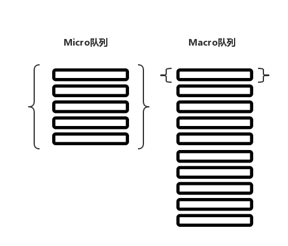
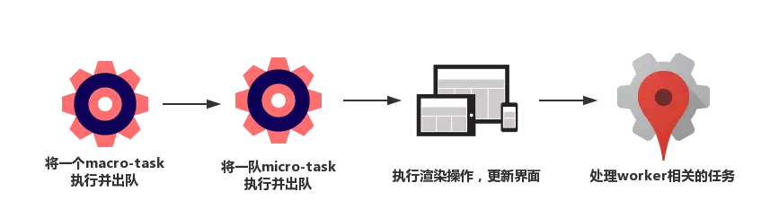

# 浏览器下的 Event Loop

### 什么是 JS Event Loop

> JS Event Loop  即事件循环，是运行在浏览器环境 / Node 环境中的一种消息通信机制，它是独立于主执行线程之外的线程。当主线程内需要执行某些可能导致线程阻塞的耗时操作时（比如请求发送与接收响应、文件 I/O、数据计算）主线程会注册一个回调函数并抛给 Event Loop 线程进行监听，自己则继续往下执行，一旦有消息返回并且主线程空闲的情况下，Event Loop 会及时通知主线程，执行对应的回调函数获取信息，以此达到非阻塞的目的。

### 执行栈和消息队列

在解析 `Event Loop` 运行机制之前，我们要先理解栈（`stack`）和队列（`queue`）的概念。

栈和队列，两者都是线性结构，但是栈遵循的是后进先出\(`last in first off LIFO`\)，开口封底。而队列遵循的是先进先出 \(`fisrt in first out，FIFO`\)，两头通透。


`Event Loop`得以顺利执行，它所依赖的容器环境，就和这两个概念有关。

我们知道，在 `js` 代码执行过程中，会生成一个当前环境的**执行上下文（ 执行环境 / 作用域）**，用于存放当前环境中的变量，这个上下文环境被生成以后，就会被推入`js`的执行栈。一旦执行完成，那么这个执行上下文就会被执行栈弹出，里面相关的变量会被销毁，在下一轮垃圾收集到来的时候，环境里的变量占据的内存就能得以释放。

这个执行栈，也可以理解为浏览器执行`JavaScript`的主线程，所有代码都跑在这个里面，以同步阻塞的方式依次执行，这是同步的场景。

那么异步场景呢？显然就需要一个独立于执行栈之外的容器，专门管理这些异步的状态，于是在“主线程”、“执行栈”之外，有了一个 `Task` 的**消息队列**结构，专门用于管理异步逻辑。所有异步操作的回调，都会暂时被塞入这个队列。`Event Loop` 处在两者之间，扮演一个大管家的角色，它会以一个固定的时间间隔不断轮询，当它发现主线程空闲，就会去到 `Task` 队列里拿一个异步回调，把它塞入执行栈中执行，一段时间后，主线程执行完成，执行栈弹出上下文环境，再次空闲，`Event Loop` 又会执行同样的操作。。。依次循环，于是构成了一套完整的事件循环运行机制。


> 上图比较简洁地描绘了整个过程，只不过其中多了 `heap` （堆）的概念，堆和栈，简单来说，堆是留给开发者分配的内存空间，而栈是原生编译器要使用的内存空间，二者独立。

### microtask 和 macrotask

如果只想应付普通点的面试，上面一节的内容就足够了，但是想要答出下面的这条面试题，就必须再次深入 `Event Loop` ，了解任务队列的深层原理：`microtask`（微任务）和 `macrotask`（宏任务）。

```javascript
// 请给出下面这段代码执行后，log 的打印顺序
console.log('script start')

async function async1() {
  await async2()
  console.log('async1 end')
}
async function async2() {
  console.log('async2 end')
}
async1()

setTimeout(function() {
  console.log('setTimeout')
}, 0)

new Promise(resolve => {
  console.log('Promise')
  resolve()
})
  .then(function() {
    console.log('promise1')
  })
  .then(function() {
    console.log('promise2')
  })

console.log('script end')

// log 打印顺序：script start -> async2 end -> Promise -> script end -> async1 end -> promise1 -> promise2 -> setTimeout
```

如果只有一个单一的 `Task` 队列，就不存在上面的顺序问题了。但事实情况是，浏览器会根据任务性质的不同，将不同的任务源塞入不同的队列中，任务源可以分为微任务（`microtask`） 和宏任务（`macrotask`），介于浏览器对两种不同任务源队列中回调函数的读取机制，造成了上述代码中的执行顺序问题。


**微任务**包括 `process.nextTick` ，`promise` ，`MutationObserver`，其中 `process.nextTick` 为 Node 独有。

**宏任务**包括 `script` ， `setTimeout` ，`setInterval` ，`setImmediate` ，`I/O` ，`UI rendering`。

### 浏览器 Event Loop 的执行机制

了解了微任务宏任务的概念后，我们就可以完整地分析一边 Event Loop 的执行机制了。

* **初始状态：**执行栈为空，micro 队列为空，macro 队列里有且只有一个 script 脚本（整体代码）
* **script 脚本执行：**全局上下文（script 任务）被推入执行栈，代码以同步的方式以此执行。在执行的过程中，可能会产生新的 `macro-task` 与 `micro-task`，它们会分别被推入各自的任务队列里
* **script 脚本出队：**同步代码执行完了，script 脚本会被移出 macro 队列，这个过程本质上是宏任务队列的执行和出队的过程。
* **微任务队列执行：**上一步已经将`script`  宏任务执行并出队了，这时候执行栈为空，Event Loop 会去 `micro-task` 中将微任务推入主线程执行，这里的微任务的执行方式和宏任务的执行方式有个很重要的区别，就是：**宏任务是一个一个执行，而微任务是一队一队执行的。也就是说，执行一个宏任务，要执行一队的微任务。**（注意：在执行微任务的过程中，仍有可能有新的微任务插入 `micro-task` 那么这种情况下，Event Loop 仍然需要将本次 `Tick (循环)` 下的微任务拿到主线程中执行完毕）



* 浏览器执行渲染操作，更新界面（这块是重点）
* 检查是否存在 Web worker 任务，如果有，则对其进行处理 。
* 上述过程循环往复，直到两个队列都清空



### 浏览器渲染时机

在上面浏览器 Event Loop 的执行机制中，有很重要的一块内容，就是浏览器的渲染时机，浏览器会等到当前的 `micro-task` 为空的时候，进行一次重新渲染。**所以如果你需要在异步的操作后重新渲染 DOM 最好的方法是将它包装成 `micro` 任务，这样 DOM 渲染将会在本次 `Tick` 内就完成**。

### 面试题解析

看到这里，相信你已经明白上面的那条面试题是怎么一回事了，我们可以用对 Event Loop 的理解来分析一下这道题目的执行：

```javascript
// 请给出下面这段代码执行后，log 的打印顺序
console.log('script start')

// 这边的 await 可能不太好理解，我换成了另一种写法
function async1() {
  async2().then(res => {
    console.log('async1 end')
  })
}
function async2() {
  console.log('async2 end')
  return Promise.resolve(undefined);
}
async1()

setTimeout(function() {
  console.log('setTimeout')
}, 0)

new Promise(resolve => {
  console.log('Promise')
  resolve()
})
  .then(function() {
    console.log('promise1')
  })
  .then(function() {
    console.log('promise2')
  })

console.log('script end')

// log 打印顺序：script start -> async2 end -> Promise -> script end -> async1 end -> promise1 -> promise2 -> setTimeout
```

*  `script` 脚本开头碰到了 `console.log` 于是打印 `script start`
*  解析引擎解析至 `async1()` ，`async1` 执行环境被推入执行栈，解析引擎进入 `async1` 内部
*  引擎发现 `async1` 内部调用了 `async2`，于是继续进入 `async 2`，并将 `async 2` 执行环境推入执行栈
*  引擎碰到 `console.log`，于是打印 `async2 end`
*  `async2` 函数执行完成，弹出执行栈，并返回了一个 `Promise.resolve(undefined)`，此时，`async1` `then` 注册的回调被推入 **microtask** ，`async1` 函数中的执行权被让出，等待主线程空闲

